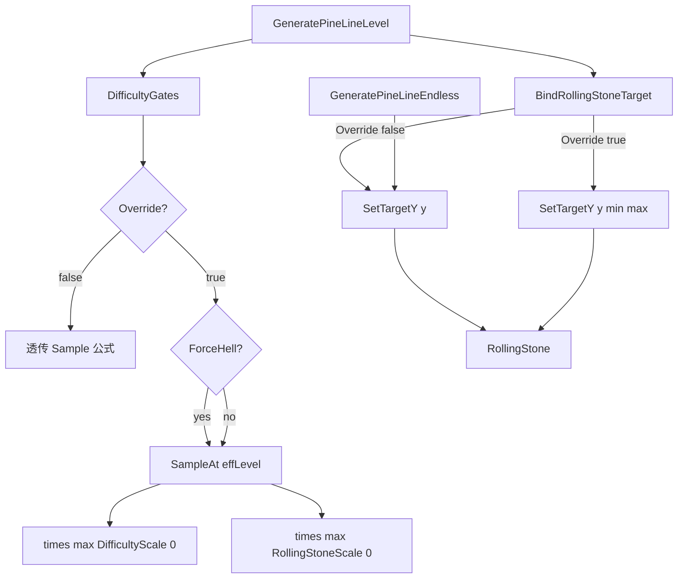

# 关卡难度总控方案（选定：总开关 + Hell + 树/石独立 Scale）

## 现有机制（简要）

关卡难度由 [`Parameters.cs`](Assets/Scripts/Assembly-CSharp/Parameters.cs) 的 `Sampler` 按 `Level.GetFloat()` 插值：

- 树：`PINE_PROBABILITY × PINE_PROBABILITY_MULTIPLIER` → [`PineGenerator.GeneratePineLineLevel`](Assets/Scripts/Assembly-CSharp/PineGenerator.cs)
- 石：仅 `ROLLING_STONE_PROBABILITY.Sample()` → 已拆为 `TrySpawnRollingStoneLevel` / `TrySpawnRollingStoneEndless`
- 滚石速度：`RollingStone.SetTargetY` 内调用 `SetSpeed`（无尽/关卡 Override 关走单参；关卡 Override 开由 Gates 注入范围）
- 关长：`TOTAL_SLIDE_DISTANCE` → [`FinishLine.OnRefresh`](Assets/Scripts/Assembly-CSharp/FinishLine.cs)

无尽刷树用 Perlin+距离，与关卡曲线分离；刷石与滚石速度已通过**调用点隔离**避免关卡 Gates 污染无尽。

## 已评估的方案与选定

- A 单 float scale：简单，但「地狱」语义弱，且无法「只加石不加树」
- B 离散档位：适合以后做 UI，当前偏重
- **C Hell + 树/石独立 Scale（选定）**：总开关下再 ForceHell + `DifficultyScale`（树）+ `RollingStoneScale`（石）；可一键关回原样
- D 虚拟关卡号直接改 Level：对速度/关长一并抬高，不如 C 可控

**选定 C + 仅关卡生效 + 总开关**：与 [`JuiceConsentGates`](Assets/Scripts/Assembly-CSharp/JuiceInternal/JuiceConsentGates.cs) 常量风格一致。

## 架构取舍：要不要「整套关卡脚本」？

**结论：不需要新建完整关卡生成器/平行 RollingStone；用「调用点隔离 + 速度注入」即可。**（已按此落地）

| 做法 | 评价 |
|------|------|
| 新建整套 LevelPineGenerator / LevelRollingStone | 过重：树路径已有 `GeneratePineLineLevel`；石只是两个共用点；复制整类会双份维护 prefab/池 |
| 在共用 helper 里堆 `GameMode.IsLevel` | 能用，但模式判断散落，以后容易漏 |
| **调用点隔离（选定，已落地）** | 关卡路径独调 `DifficultyGates`；无尽路径继续原 `Sample()`，**零引用** Gates；滚石速度由 `BindRollingStoneTarget` / `SetTargetY` 注入 |

耦合其实不重：刷树早已分 Level/Endless；真正共享的只有刷石与滚石速度。拆调用点 + 注入速度，比再开一套脚本更干净。

## 行为定义（写死，与当前实现一致）

新增 [`DifficultyGates.cs`](Assets/Scripts/Assembly-CSharp/DifficultyGates.cs)（`namespace LevelMode`）：**假定只被关卡路径调用**，内部不读 `GameMode`。

```csharp
/// <summary>总开关：false=完全原样；true=才应用下方 Hell / 树 Scale / 石 Scale。</summary>
public const bool EnableDifficultyOverride = false; // 发版默认

/// <summary>仅当总开关为 true 时生效（调用方须保证仅关卡路径使用本类）。</summary>
public const bool ForceHellDifficulty = false;

/// <summary>仅当总开关为 true 时生效：只乘在树上，建议 0~2。</summary>
public const float DifficultyScale = 1f; // 发版默认

/// <summary>仅当总开关为 true 时生效：只乘在滚石概率上，建议 0~3。</summary>
public const float RollingStoneScale = 1f; // 发版默认

/// <summary>Hell 时喂给 Sampler 的虚拟关卡号（对齐曲线右端）。</summary>
public const float HellVirtualLevel = 1000f;
```

> **注意**：本地调试时可能临时把 `EnableDifficultyOverride=true`、`DifficultyScale` 调大；**发版默认必须回到** `Override=false`、`DifficultyScale=1`、`RollingStoneScale=1`。计划与验收以发版默认为准，不以当前调试常量为准。

### 倍率职责（硬约束）

| 常量 | 作用范围 | 不作用 |
|------|----------|--------|
| `DifficultyScale` | **仅** `GetPineLineChance()`（树） | 石概率、滚石速度 |
| `RollingStoneScale` | **仅** `GetRollingStoneChance()`（石） | 树概率、滚石速度 |
| `ForceHell` / `HellVirtualLevel` | 树与石的 `SampleAt` 共用有效等级；速度注入也走有效等级 | 关长、操控 |

速度**不乘**任一 Scale；仅 Override 开时按有效等级取样 min/max 注入。

### 「石多、树不变」用法示例

```text
EnableDifficultyOverride = true   // 必须打开，否则下方 Scale 不生效
ForceHellDifficulty = false       // 按需；true 则树/石都按 HellVirtualLevel 取样曲线
DifficultyScale = 1f              // 树倍率不变
RollingStoneScale = 2f~3f         // 只拉高滚石概率
```

反向「树多、石不变」：`DifficultyScale` 调高、`RollingStoneScale = 1`。

### 总开关语义（硬约束靠调用点，不靠 GameMode 分支）

| 条件 | 行为 |
|------|------|
| 无尽路径 | **禁止**调用 `DifficultyGates`；继续 `Parameters.*.Sample()` + `SetTargetY(y)` |
| 关卡 + `EnableDifficultyOverride == false` | Helper 内部直接原版 `Sample()`（及树距离倍率），不读 Hell / 两 Scale |
| 关卡 + Override **true** | 有效等级 = `ForceHell ? HellVirtualLevel : Level.GetFloat()`；树概率 × `max(0, DifficultyScale)`、石概率 × `max(0, RollingStoneScale)`，各自再 Clamp01 |



### 关卡路径精确公式

**树（仅改 `GeneratePineLineLevel` → `GetPineLineChance`）**

```text
base = PINE_PROBABILITY.SampleAt(effectiveLevel)
distMul = PINE_PROBABILITY_MULTIPLIER.Sample()   // 仍按距离，不改
chance = Clamp01(base * distMul * max(0, DifficultyScale))
// DifficultyScale 只乘树；不乘石
```

**石生成（拆分调用点，不用共用方法里塞模式判断）**

```text
// GeneratePineLineLevel → TrySpawnRollingStoneLevel：
chance = Clamp01(DifficultyGates.GetRollingStoneChance())
// GetRollingStoneChance 内部：Override 关则 Sample()；开则 SampleAt(eff)×RollingStoneScale
// 不乘 DifficultyScale；不乘 ROLLING_STONE_PROBABILITY_MULTIPLIER（死代码，不接线）

// GeneratePineLineEndless → TrySpawnRollingStoneEndless：
chance = ROLLING_STONE_PROBABILITY.Sample()   // 永不调用 DifficultyGates
```

**滚石速度（注入时序写死，避免双次 Random / OnEnabled 抢跑）**

现网顺序：`Get()` → `OnEnabled` → 调用方摆位。`SetSpeed` 已**移出** `OnEnabled`，改为仅在 `SetTargetY` 内调用一次。

**已落地实现**：

1. `SetSpeed()` **移出** `OnEnabled`，改为仅在 `SetTargetY` 内调用一次（两模式刷石均在 `Get` 后立刻摆位，行为保持「每石一次随机」）。
2. `SetTargetY(float y)`：内部用 `Parameters.ROLLING_STONE_MIN/MAX_SPEED.Sample()` 再摆位——**无尽**与**关卡 Override=false** 都走此重载。
3. `SetTargetY(float y, float minSpeed, float maxSpeed)`：用注入范围 `SetSpeed` 再摆位——**仅**关卡 Override=true 时由 `DifficultyGates.BindRollingStoneTarget` 调用；min/max 用 `SampleAt(GetEffectiveLevel())`（Hell 与非 Hell 统一走有效等级）。
4. **速度不乘** `DifficultyScale` / `RollingStoneScale`。
5. 关卡刷石点调用 `BindRollingStoneTarget(stone, y)`，内部按 Override 分支选单参或注入重载（调用方不必自己判断）。

**明确不改（范围外）**

- `TOTAL_SLIDE_DISTANCE` / FinishLine 关长
- `SKIER_MANIABILITY_RELATIVE_TO_OLD_CHILLY_SNOW`（转弯手感，按距离而非关卡号）
- `GeneratePineLineEndless` 刷树逻辑
- 不新建平行生成器/平行滚石组件
- 不启用未接线的 `ROLLING_STONE_PROBABILITY_MULTIPLIER`

为支持 `SampleAt`，小改 [`Sampler`](Assets/Scripts/Assembly-CSharp/Sampler.cs)：增加 `SampleAt(float)`，`Sample()` → `SampleAt(GetValue())`。（已落地）

### Helpers 内部约定

- `GetEffectiveLevel()` **仅在 Override==true 时使用**：`ForceHellDifficulty ? HellVirtualLevel : Level.GetFloat()`；Override==false 时 helpers 直接 `Sample()`，即使 `ForceHell==true` 也忽略。
- 关卡路径概率可始终调 Gates（Override 关=透传）；**速度**经 `BindRollingStoneTarget`：仅 Override 开才注入重载。
- 无尽路径：**源码零引用** `DifficultyGates`（比运行时 `IsLevel` 门控更硬）。
- `SetSpeed(min,max)` 内对调换做 `if (max < min) swap`，防止误传。
- `SetSpeed` 迁入 `SetTargetY` 后：**凡 `RollingStone.Get()` 必须同帧调用某一 `SetTargetY`**（现网唯一调用点已满足；代码注释标明契约）。

### 调试预设（User 改常量时参考；发版默认见首行）

| 目的 | EnableOverride | ForceHell | DifficultyScale（树） | RollingStoneScale（石） |
|------|----------------|-----------|----------------------|-------------------------|
| 发版/对照现网 | false | * | * | * |
| 一键地狱密度 | true | true | 1 | 1 |
| 仅加倍树密度 | true | false | 2 | 1 |
| 仅加倍石密度（石多树不变） | true | false | 1 | 2~3 |
| 树石都加倍 | true | false | 2 | 2 |
| 地狱拉满（压池测） | true | true | 2 | 2 |
| 清空障碍（测关长） | true | false | 0 | 0 |

## 审查发现的漏洞与补丁（已写入方案）

1. **共用路径污染无尽（致命）**  
   **补丁**：调用点隔离；无尽零引用 Gates。

2. **树公式漏乘距离倍率**  
   **补丁**：`GetPineLineChance()` 内部 `base×distMul×DifficultyScale` 再 Clamp。

3. **死代码倍率误接线**  
   **补丁**：石路径不接 `ROLLING_STONE_PROBABILITY_MULTIPLIER`。

4. **Scale ≤ 0 / 极大**  
   **补丁**：树/石各自 `max(0, Scale)` + Clamp01。

5. **整套关卡脚本过度设计**  
   **补丁**：否决。

6. **滚石注入时序 / 双次 SetSpeed（致命）**  
   `OnEnabled` 已不再 `SetSpeed`；摆位依赖 `SetTargetY` 内一次速度随机。  
   **补丁**：`SetSpeed` 迁入 `SetTargetY`；Override 关走单参重载；Override 开走注入重载（经 `BindRollingStoneTarget`）；保证每石只 roll 一次。

7. **「地狱模式」预期范围误解**  
   本方案只抬树/石生成与滚石速度，不缩短关卡、不改滑雪操控。  
   **补丁**：范围外清单写死；验收不要求关长/转弯变化。

8. **新脚本 .meta**  
   Agent 只写 `.cs`；Unity 自动生成 `.meta`。

9. **SetSpeed 外迁后的调用契约**  
   若未来有人 `Get()` 却不 `SetTargetY`，滚石速度为 0/脏值。  
   **补丁**：`SetTargetY` 旁中文注释写清契约；本次不新增其它调用点。

10. **池耗尽不崩**  
    现网 `pine == null` / `stone == null` 已 skip。Hell 下可能「变稀」而非异常。  
    **补丁**：验收允许掉刷；不作为失败条件；User 压力测池。

11. **流程图曾暗示「关卡总是注入速度」**  
    **补丁**：改为 Override 分支；Override 关与无尽同走单参 `SetTargetY(y)`。

12. **单 Scale 无法「只加石不加树」**  
    **补丁**：拆出 `RollingStoneScale` 只乘石；`DifficultyScale` 只乘树。

## Agent 执行项（已全部落地）

1. ✅ 新增 `Assets/Scripts/Assembly-CSharp/DifficultyGates.cs`：常量（含 `RollingStoneScale`）+ 中文注释 + `GetEffectiveLevel` + `GetPineLineChance` / `GetRollingStoneChance` / `BindRollingStoneTarget`；**不读 GameMode**；树乘 `DifficultyScale`、石乘 `RollingStoneScale`
2. ✅ 扩展 `Sampler.SampleAt`；`Sample()` 复用
3. ✅ [`PineGenerator.GeneratePineLineLevel`](Assets/Scripts/Assembly-CSharp/PineGenerator.cs)：树 → `GetPineLineChance()`；拆 `TrySpawnRollingStoneLevel`：概率用 Gates；摆位 → `BindRollingStoneTarget`
4. ✅ [`PineGenerator`](Assets/Scripts/Assembly-CSharp/PineGenerator.cs) 无尽刷石：`TrySpawnRollingStoneEndless`，仅 `Sample()` + `SetTargetY(y)`，不引用 Gates
5. ✅ [`RollingStone`](Assets/Scripts/Assembly-CSharp/RollingStone.cs)：`SetSpeed` 移出 `OnEnabled`；`SetTargetY` 单参/双速度重载（注入路径 min/max 校正）；注释标明 Get→SetTargetY 契约
6. ✅ 不改场景/prefab/meta；不接石距离倍率死代码；不加 UI；不改 EndlessRes；不改 WarmUp 默认 300/8

## 审核状态

实现已与方案对齐（含树/石独立倍率与 `BindRollingStoneTarget`）。发版前请将调试常量恢复为发版默认。

## User 手调：`ROLLING_STONE_PROBABILITY` 曲线（与 DifficultyGates 分离）

> **性质**：User 直接改 [`Parameters.cs`](Assets/Scripts/Assembly-CSharp/Parameters.cs) 的基值 Sampler，**不是** `DifficultyGates` 常量。发版默认 Gates 约定不变：`EnableDifficultyOverride=false`、`DifficultyScale=1`、`RollingStoneScale=1`、`ForceHell=false`。本条只记录已发生的曲线数值调整。

**改前（git HEAD）**

```csharp
new Sampler(Level.GetFloat, 1f, 0f, 2f, 0f, 3f, 0.005f, 4f, 0.006f, 20f, 0.012f, 100f, 0.018f, 1000f, 0.021f)
```

**改后（当前工作区）**

```csharp
new Sampler(Level.GetFloat, 1f, 0.1f, 2f, 0.2f, 3f, 0.005f, 4f, 0.006f, 20f, 0.012f, 100f, 0.018f, 1000f, 0.021f)
```

| 关卡键点 | 改前 | 改后 |
|----------|------|------|
| 1 | 0 | **0.1** |
| 2 | 0 | **0.2** |
| 3 | 0.005 | 0.005（未改） |
| 4 | 0.006 | 0.006（未改） |
| 20 | 0.012 | 0.012（未改） |
| 100 | 0.018 | 0.018（未改） |
| 1000 | 0.021 | 0.021（未改） |

**对 `RollingStoneScale` 的影响**：改前第 1–2 关基值为 0，即使 Override 打开且 `RollingStoneScale>1`，低关 `chance = Clamp01(0 × Scale)` 仍为 0，石倍率无效。改后基值非零，**低关也会吃到 `RollingStoneScale`**（仍须 `EnableDifficultyOverride=true`）。Override 关闭时仍只走改后的 Parameters 基值曲线，不乘 Scale。

## User 待办项

- 调试：改 `DifficultyGates` 常量后重新编译，进**关卡**验证 Hell / 树 Scale / 石 Scale（含「石多树不变」）
- 回归：同配置进**无尽**，树/石与改前一致（注意：无尽刷石仍 `ROLLING_STONE_PROBABILITY.Sample()`，会间接吃到本次曲线手调）
- Hell 压力：开 Override+Hell 跑一局，观察树/石对象池是否打空（掉刷）；若频繁缺对象，再在编辑器侧加大 WarmUp（本次 Agent 不改池容量，除非联调证明必要）
- **发版：保持 `EnableDifficultyOverride = false`，且 `DifficultyScale = 1`、`RollingStoneScale = 1`**（若本地调试改过，发版前改回）；滚石概率曲线以 User 手调后的 Parameters 为准，不必为此改 Gates
- 本次不做设置页 UI
- Unity 打开工程一次，让新脚本自动生成合法 `.meta`（若尚未生成）

## 验收

- 总开关 **false**：关卡与无尽均跟当前 Parameters 基值一致（第 1 关树稀；第 1–2 关滚石基值已为 0.1 / 0.2，不再「前几关无石」；关长/操控不变）
- 总开关 **true** + Hell **true** + 两 Scale **1** + 关卡：第 1 关树/石接近高等级；滚石更快；**关长仍按真实 Level**
- 总开关 **true** + Hell **true** + 两 Scale **2** + 关卡：高等级概率各自再 ×2 后 Clamp01
- 总开关 **true** + Hell **true** + 无尽：与现网无尽一致
- 总开关 **true** + Hell **false** + `DifficultyScale=2` + `RollingStoneScale=1` + 关卡：树约翻倍且 ≤1，石与现网等级曲线一致
- 总开关 **true** + Hell **false** + `DifficultyScale=1` + `RollingStoneScale=2` + 关卡：**石约翻倍且 ≤1，树不变**（石倍率独立）
- 每颗滚石仅一次速度随机（无双次 `SetSpeed`）
- `Sample()` 行为不变（仅多一层 `SampleAt` 转发）
- 速度不随任一 Scale 变化

## 残余风险

- Scale/Hell 过大时满屏树仍可能压池（WarmUp 300/8）——掉刷已有 null skip；加大池属联调后决策
- Hell 曲线右端若改 Parameters 键点，需同步 `HellVirtualLevel`
- 无尽滚石速度现网已间接吃 `Level.GetFloat()`（存档关卡号）；本方案不放大该历史耦合
- 常量需改代码重编译，非运行时 UI（与 JuiceConsentGates 一致）
- 未来若新增 `RollingStone.Get()` 调用点却忘记 `SetTargetY`，会踩 SetSpeed 外迁契约（注释约束，无编译期强制）
- 本地调试常量若忘记改回发版默认，会把高密度带进正式包——发版检查清单已写明
