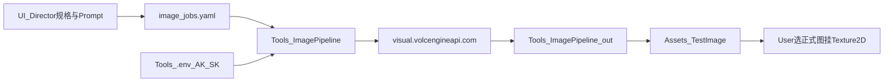
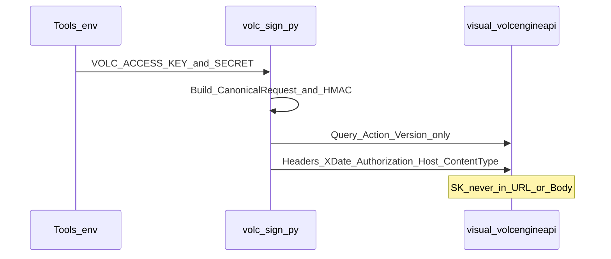

# 即梦 API 图片生成工具接入计划

## 目标与边界

- **目标**：制作期用 [即梦图片生成 4.0](https://docs.volcengine.com/docs/85621/1817045?lang=zh) 批量生成项目所需图片，落盘到 [`Assets/TestImage/`](Assets/TestImage/)。
- **边界**：游戏运行时**不**调用即梦；生成结果默认是概念/对照图（`mock_*` / `concept_*`），正式 Sprite 仍需 User 从白名单拷到 `Assets/Texture2D/` 并挂场景（对齐 [`human-ai-boundary`](.cursor/rules/human-ai-boundary.mdc) 与 [`artifact-location`](.cursor/rules/artifact-location.mdc)）。
- **替换关系**：补充并落地 [`ui_art_pipeline_midjourney.plan.md`](.cursor/plans/ui_art_pipeline_midjourney.plan.md) 中「外绘」一环——本仓库主路径改为 **Jimeng API**，Midjourney 保留为可选人工工具。



## API 定稿（按 4.0 文档）

| 项 | 值 |
|---|---|
| Endpoint | `https://visual.volcengineapi.com` |
| Submit | `Action=CVSync2AsyncSubmitTask&Version=2022-08-31` |
| Query | `Action=CVSync2AsyncGetResult&Version=2022-08-31` |
| Region / Service | `cn-north-1` / `cv` |
| req_key | `jimeng_t2i_v40` |
| 鉴权 | **严格按官方「Header 场景」公共签名参数**（见下）；与 TTS 的 `VOLC_TTS_API_KEY` **不是同一套** |
| 轮询 | 提交拿 `task_id` → 轮询至 `success`/`failed` → 用 `image_urls` 下载（`req_json.return_url=true`） |

宽高：图标默认 `1328×1328`（可缩小交付）；首页竖屏 mock 用接近 `9:16` 的推荐档（如 `936×1664` 或文档允许的竖版档），在 catalog 里写死 `width`/`height`。所有请求宽高必须落在官方允许档内，且不超过 **4096×4096**。

### 输入/输出限制（必须遵守）

依据即梦图片生成 4.0 文档限制，Pipeline 实现与 catalog 必须对齐：

| 类别 | 约束 |
|---|---|
| 输入图格式 | 仅 **JPEG / PNG**（建议 JPEG） |
| 输入图大小 | 单张最大 **15MB**；最多 **14** 张输入图 |
| 输入/输出分辨率 | 最大 **4096×4096**；catalog 与参考图校验均禁止超出 |
| 输出数量 | 最大输出张数 = `15 - 输入图数量`；官方建议输出 **≤6**；本 Pipeline **默认强制 1 张** |
| 延迟/计费 | 分辨率越高、张数越多，延迟与费用越高；按输出张数计费；默认会按 prompt 意图推断张数 |

**本项目硬性策略（对延迟与价格敏感）：**

1. 所有任务请求体设置 **`force_single=true`**，强制只出 1 张；且保证 `输入图数量 + 1 ≤ 15`。
2. catalog 里每条 job 只对应 **1 个交付文件名**；不做「一次 API 出多张再拆分」。
3. **本版同时支持文生图与参考图（图生图/多图参考）**，见下一节。
4. 下载落盘统一保存为 **PNG** 到 `Assets/TestImage/`；上游 JPEG 则下载后按需转 PNG，失败保留原格式并打日志。
5. README 写明：勿在 prompt 里写「生成 N 张 / 拼图四宫格」类诱导多图意图；多方案用多条 yaml 分次调用。

### 参考图逻辑（本版必做）

有 `binary_data_base64` 或 `image_urls` 即为带参考图任务；两者都空则为纯文生图。同一请求二者**二选一**（优先本地文件 → base64，避免依赖外网 URL 可达性）。

**catalog 字段（每条 job）：**

```yaml
- id: concept_mode_btn_level
  prompt: "..."
  width: 1328
  height: 1328
  filename: concept_mode_btn_level.png
  force_single: true
  # 参考图（可选；0~14 张）
  refs:
    - path: Assets/TestImage/_img_preview/slice_btn_level_on.png   # 仓库相对路径，本地读入
    # - url: https://example.com/ref.jpg                          # 可选：公网 URL（写入 image_urls）
  # scale: 0.5   # 可选；文本影响强度，有 refs 时默认 0.5（若 API 字段名不同以实现时文档为准）
```

**脚本行为：**

1. 解析 `refs`：本地 `path` → 读文件 → 校验 → 编入 `binary_data_base64`；`url` → 编入 `image_urls`。同一 job **不允许混用 path 与 url**（避免协议混杂；需要混用时拆成两条 job）。
2. **提交前校验**（不通过则跳过该 job 并报错退出码非 0）：
   - 扩展名仅 `.jpg` / `.jpeg` / `.png`
   - 单文件 ≤ 15MB
   - 张数 ≤ 14
   - 用标准库读 PNG/JPEG 头或轻量校验宽高 ≤ 4096（读不出分辨率则 warning 仍提交，由 API 兜底）
3. 请求体：`req_key=jimeng_t2i_v40` + `prompt` + `width`/`height` + `force_single` +（有 refs 时）`binary_data_base64` 或 `image_urls`。
4. **增量 hash** 计入：prompt、size、req_key、force_single、**每张参考图的内容 sha256**（或 url 字符串），改参考图会重跑。
5. `--probe` 分两档：默认纯文生图探针；`--probe-ref` 用 `catalog/refs/probe_ref.png`（仓库内放一张小 PNG）验证参考图通路。

**目录补充：**

```text
Tools/ImagePipeline/catalog/refs/   # 可选：pipeline 自带小参考图（如 probe）
```

参考图也可直接指向已有 [`Assets/TestImage/`](Assets/TestImage/) 白名单资源（如 `_img_preview/slice_btn_*`、`mock_hud_*`），不必复制一份。

### 鉴权定稿（符合公共参数 · Header 场景）

规范依据：[公共参数 - 签名参数 - 在 Header 中的场景](https://docs.volcengine.com/docs/6369/67268?lang=zh) + [签名方法](https://www.volcengine.com/docs/6369/67269)。

**硬性约定（本 Pipeline 只实现 Header 鉴权，不实现 Query 签名场景）：**

1. **Query 仅放**（官方要求 Action/Version 必须在 query）：
   - `Action`（提交 / 轮询）
   - `Version=2022-08-31`
   - 可选：`X-Expires`（默认 900，一般不传）
2. **签名参数全部放 Header**（符合「在 Header 中的场景」）：

| Header | 必填 | 含义 |
|---|---|---|
| `X-Date` | 是 | UTC：`YYYYMMDD'T'HHMMSS'Z'` |
| `Authorization` | 是 | `HMAC-SHA256 Credential={AccessKeyId}/{ShortDate}/{Region}/{Service}/request, SignedHeaders={SignedHeaders}, Signature={Signature}` |
| `Host` | 是（参与签名） | `visual.volcengineapi.com` |
| `Content-Type` | 是（参与签名） | `application/json`（请求体为 JSON 时） |
| `X-Content-Sha256` | 推荐参与签名 | Body SHA256 hex |
| `X-Security-Token` | 否 | 仅 STS 临时凭证时需要；长期 AK/SK 不传 |

3. **`Authorization` 内字段**（与文档一致）：
   - `AccessKeyId` ← `VOLC_ACCESS_KEY`
   - `ShortDate` ← `X-Date` 的日期部分 `YYYYMMDD`
   - `Region` ← `cn-north-1`
   - `Service` ← `cv`
   - `SignedHeaders` ← 至少包含 `content-type;host;x-content-sha256;x-date`（小写、分号分隔）
   - `Signature` ← 按签名方法用 `VOLC_SECRET_KEY` 本地 HMAC 算出
4. **禁止事项**：
   - 不把 SK 放进 URL / Body / Header 明文
   - 不把鉴权改成 Query 场景的 `X-Algorithm` / `X-Credential` / `X-Signature`（官方虽支持，本项目不采用，避免两套实现）
5. **实现落点**：`Tools/ImagePipeline/scripts/volc_sign.py` 按官方 SigV4 步骤产出上述 Header；`generate.py` 只负责组业务 Body + 调签 + 发 POST。

对比 TTS：语音是 `X-Api-Key`；即梦 Visual 是 **AK/SK → Header SigV4 `Authorization`**。



## 密钥（User）

写入已忽略的 [`Tools/.env`](Tools/.env)（勿提交）——这是 **本机环境变量给 Python 读**，不是给浏览器/URL 用：

```text
VOLC_ACCESS_KEY=
VOLC_SECRET_KEY=
# 可选别名兼容
# VOLCENGINE_AK=
# VOLCENGINE_SK=
```

说明：现有 `VOLC_TTS_API_KEY` 只服务语音 Pipeline；即梦 Visual 必须另配 AK/SK（控制台 IAM 密钥管理）。

## 目录结构（对标 VoicePipeline）

新建 [`Tools/ImagePipeline/`](Tools/ImagePipeline/)：

```text
Tools/ImagePipeline/
  README.md
  .gitignore          # out/、临时文件
  catalog/
    image_jobs.yaml   # 任务：id/prompt/size/filename/refs
    style_prefix.txt  # 统一风格前缀
    refs/             # pipeline 自带小参考图（probe 等）
  scripts/
    generate.py       # --probe / --probe-ref / 批量 / --only / 增量 hash
    volc_sign.py      # SigV4 Header 签名（stdlib + hmac）
  out/
  manifests/
    generated.json    # 增量：prompt+size+req_key+refs内容hash
```

最终交付：脚本成功后 `copy` 到 `Assets/TestImage/`（文件名以 catalog 为准）。

## 脚本行为（Agent 实现）

1. `load_dotenv`：复用 Voice 逻辑，读 [`Tools/.env`](Tools/.env)。
2. `volc_sign.py`：严格按 [公共参数 Header 场景](https://docs.volcengine.com/docs/6369/67268?lang=zh) 产出 `X-Date` + `Authorization`（及参与签名的 Host/Content-Type/X-Content-Sha256）；**不**走 Query 签名参数。
3. `--probe`：纯文生图 1 张；`--probe-ref`：带 1 张本地参考图，验证图生图通路。
4. 读 `image_jobs.yaml`：组装 Body（含可选 refs）→ `Submit → Poll → Download → out/ → Assets/TestImage/`；一律 `force_single`；校验宽高与参考图限制。
5. 增量：hash 含参考图内容；未变则跳过。
6. 日志不打印 Secret / 不打印完整 base64；失败打印 `code/message/request_id`；多 URL 只取第一张并 warning。
7. 依赖：仅 `pyyaml` + 标准库（`urllib`/`hmac`/`hashlib`/`base64`）；不强制装火山 SDK。

## V1 首批生成任务（写进 yaml）

依据 UI Audit / 首页方案，首批 4 条；**其中按钮类带参考图**，首页 mock 可选带现有 HUD 对照：

| id | 模式 | 参考图 | 建议尺寸 | 交付名 |
|---|---|---|---|---|
| `mock_home_first30_v2` | 文生 + 可选 1 张对照 | `Assets/TestImage/_img_preview/mock_hud_level_mode.png`（若存在） | 竖屏 ~9:16 | `mock_home_first30_v2.png` |
| `concept_mode_btn_level` | 参考图 | `slice_btn_level.png` + `slice_btn_level_on.png` | 1:1 | `concept_mode_btn_level.png` |
| `concept_mode_btn_endless` | 参考图 | `slice_btn_endless.png` + `slice_btn_endless_on.png` | 1:1 | `concept_mode_btn_endless.png` |
| `concept_skins_btn` | 参考图 | `slice_btn_level.png`（作 UI 语言锚点） | 1:1 | `concept_skins_btn.png` |

参考图路径均相对仓库根，目录在 `_img_preview/`。若某文件缺失：该 job 降级为纯文生图并 **warning**（不中断整批），README 注明。

Prompt 约束（写入 `style_prefix.txt` + 各 job）：
- Keep：浅底、橙/绿圆角方钮、轻 3D、白图标、滑雪 hyper-casual；**有 refs 时明确「保留参考图布局/比例，优化材质与状态可读」**。
- Improve：主 CTA `TAP TO PLAY`、MODE/SKINS 底栏成对、模式状态可读。
- Must not：复杂 RPG UI、重粒子、把 mock 当正式九宫切图、遮挡主路径、诱导输出多张图。

## 文档同步

- 更新 [`Tools/VoicePipeline/README.md`](Tools/VoicePipeline/README.md) 旁新增 Image README。
- 更新 [`ui_art_pipeline_midjourney.plan.md`](.cursor/plans/ui_art_pipeline_midjourney.plan.md)：生成层改为「Jimeng Pipeline 为主」。
- 在 [`AI_CONTEXT.md`](AI_CONTEXT.md) §5 增加一行：图片制作期 → `Tools/ImagePipeline` + `Assets/TestImage/`。

## 分工

### Agent
- 落地 `Tools/ImagePipeline`（含参考图校验、base64/`image_urls`、增量 hash）。
- `--probe` 与 `--probe-ref` 通过后批量出图并拷到 `Assets/TestImage/`。
- 不改场景 / Prefab / meta；不把真实 AK/SK 写入仓库。

### User
- 在 `Tools/.env` 填写 `VOLC_ACCESS_KEY` / `VOLC_SECRET_KEY`，并确认控制台已开通即梦图片 4.0。
- 确保首批参考图源文件在 `Assets/TestImage/_img_preview/`（或接受缺失时降级文生图）。
- 审图后挑选正式资源，复制到 `Assets/Texture2D/` 并挂 UI。
- 真机确认首屏层级。

## 验收

1. `--probe` 与 `--probe-ref` 均成功（证明 Header 鉴权 + 参考图通路）。
2. 批量 4 条任务均出现在 `Assets/TestImage/`；每条仅 1 张（`force_single`）。
3. 带 refs 的 job 请求体含 `binary_data_base64`（本地 path）或 `image_urls`；校验拒绝非法格式/超限。
4. `git status` 不见 `Tools/.env`。
5. `mock_*` / `concept_*` 未被脚本写入 `Assets/Texture2D/`。
6. Query 仅有 Action/Version；鉴权在 Header（无 Query 版 `X-Signature`）。
7. catalog 宽高与参考图均 ≤4096；输入张数 ≤14。

## 实现顺序

1. 脚手架 + SigV4 Header + `--probe`
2. 参考图校验/编码 + `--probe-ref`
3. catalog yaml（含 refs）+ 增量批量 + 交付到 TestImage
4. 跑通首批 4 张并更新艺术流水线文档
5. User 审图 / 正式挂载（本计划外）
