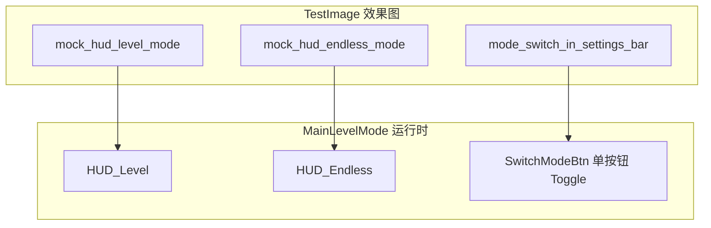
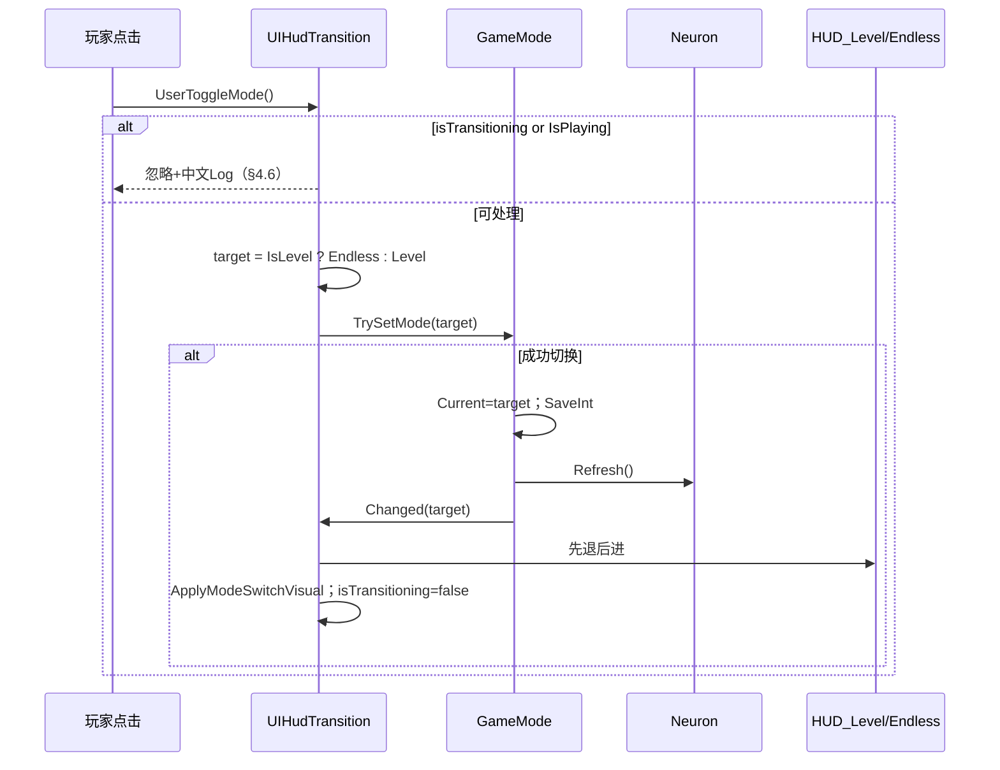
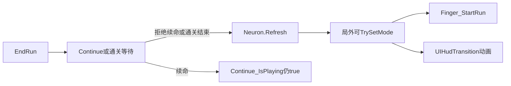

# 双模式场景合并与玩法切换（可执行详规）

> **权威关系**：本文件 = 场景合并 + Build + Prefab/切图白名单 + 切换动画 + 共用 UI + **DoD** 的交付图纸。玩法分支契约与 [`.cursor/plans/无尽模式整合_aad17a98.plan.md`](d:\Workspace\Github\chillysnow\.cursor\plans\无尽模式整合_aad17a98.plan.md) **对齐并继承**（该计划 YAML todos 标 completed，但仓库**无** `GameMode.cs` / `UIHudTransition.cs`，代码未落地——以本计划 todos 为准重新实施）。  
> **切图交叉链接**：Import / 坏图审查 / 九宫实测 / 透明对比等**大段切图表**以图片专用计划为准——查找 `.cursor/plans/模式切换图片使用与审查_*.plan.md`（仓库与 `~/.cursor/plans/`）。**当前（2026-07-15）尚未检出该文件** → 暂以本文件 **§2.3 白名单** 为准；图片计划落地后：**勿在本文件重复粘贴大段切图表**，只保留白名单 + 链接。  
> **切图实施备注（2026-07-15）**：切图以本合并计划临时默认/占位即可；图片计划附录 A 延后另执行。**不**阻塞 M1 代码开工，**不必**等 slice 终检对齐再写 `GameMode`/`UIHudTransition`。  
> **卡顿优化交叉链接**：池 / WarmUp / 裁剪 / `WxPerf` 以 [`.cursor/plans/微信小游戏卡顿优化_ac7b571d.plan.md`](d:\Workspace\Github\chillysnow\.cursor\plans\微信小游戏卡顿优化_ac7b571d.plan.md) 为准；切模式与 WarmUp 交互见 **§7.1**。  
> **人机边界**：Agent 只改 `Assets/Scripts/Assembly-CSharp/**/*.cs`；场景 / Prefab / Texture / meta / Build Settings = User。序列化入口旁必须 `// TODO: [User Action] ...`。  
> **User 动手**：逐步点击照做清单见 **[§U](#u-user-逐步点击清单最快跑通)**（U1–U32）；摘要清单见 §15；**合并成功定义**见 **§19**。  
> **硬约束不变**：LevelMode `Neuron` 唯一宿主；**禁止双栈**（禁止同场景挂 `EndlessMode.App` / `EndlessMode.Player`）；v1 **不做**完整 Skins / NightMode / Pause 全页（见 §12）。  
> **开写 M1 前**：过 **§13.0 就绪检查清单**（U1–U18 可并行，非阻塞）。

### [Draft: 初始架构]
- 唯一场景：演进后的 `MainLevelMode`（Build index 0）；`MainEndlessMode` 仅作 UI/美术参考。
- 宿主：`LevelMode.Neuron`；新增 `GameMode` + `UIHudTransition`（先退再进）。
- UI：共用 Continue/Settings 常驻；`HUD_Level` / `HUD_Endless` 互斥；正式切图来自 `Assets/TestImage/` 的 `ui_*` / `slice_*`。

### [Iteration 1: 漏洞注入与重构]
1. **状态机**：双开 Endless App + Level → DDOL/双 Neuron。
2. **时序**：若先 `Changed` 再改 `Current` / 再 `Refresh`，或先 `Refresh` 再改 `Current` → OnRefresh/HUD 读旧模式（坐标无法按新模式还原）。
3. **边界**：FinishLine 距离 0 → Level 进度 NaN；池/队列未清。
4. **过度设计**：同场景双栈显隐否决。

- **补丁**：单宿主；`TrySetMode` = **先** `Current`+Data **再** `Neuron.Refresh` **最后** `Changed`（OnRefresh 读新模式；HUD 仅听 Changed）；v1 明确共用 + 模式 HUD。**不**采用「给 Refresh 传目标模式」。

### [Iteration 2: 继续找茬]
1. **生命周期**：`EndRun` 后 `IsPlaying` 仍 true → 须 Refresh 后才可切（产品层局内隐藏/灰显切换按钮；实现层仍靠 `IsPlaying` 守卫）。
2. **并发**：`Changed` 内禁止再 `TrySetMode`/`Refresh`；动画中禁止再点。
3. **边界**：无尽→关卡须还原 `PineGenerator` 世界坐标（`OnRefresh` 读 `GameMode.IsLevel` 即可，因 Refresh 时 `Current` 已是目标）；`Pine.ResetState` 模式无关整局清零。
4. **范围**：不把 `EndlessRes` 当第二运行入口；不双挂 Player+Skier。

### [Iteration 3: 场景/资源特有]
1. **误进旧场景**：`MainEndlessMode` + App DDOL 与 Juice Essential 冲突。
2. **资源双池**：LevelPine vs Endless Pine 双 Load 炸池 → **写死 LevelPine**。
3. **切图**：效果图误当正式 Sprite、非透明底、坏文件 `ui_btn_mode_level_selected.png`(667B) 会导致白块/破图。

- **退出**：进入 Final Plan。

---

## 0. 调研结论快照（实施前勿推翻）

### 0.1 Build / 启动

| 项 | 现状 | 合并后 |
|----|------|--------|
| `MainLevelMode` | Build **enabled index 0** | **唯一启用场景** |
| `MainEndlessMode` | index 2 **disabled** | 保持 disabled；**禁止运行入口** |
| `Launch` | disabled | 保持 disabled |
| Level 入口 | `JuiceInitializer` → Essential DDOL | **不变** |
| Endless 入口 | 根 `App` DDOL + `LoadScene("MainEndlessMode")` | **永不进入运行时** |

### 0.2 根节点与 Canvas（调研摘录）

**MainLevelMode 已有**：`Camera`、`Canvas`、`EventSystem`、`Skier`、`PineGenerator`、`FinishLine`、`WoodSign`、`Noise`；Canvas 下含 `Level`、`Score`、`Continue`、`SettingsBar`、`Tutorial`、`Motivational`、`PremiumButton`、`GDPRButton`、`TransitionWhite` 等。

**MainEndlessMode 多出且 v1 不迁入**：`App`、`Player`、`Menu`、`Pause`、`Skins`/`AllSkins`、`NightMode`、`Rate`、`DebugPage`、`GameCenter`、皮肤色板树。

**可从 Endless 复制（仅视觉）**：`Scores` 子树中「当前分 / Best」相关 Text → 挂到 `HUD_Endless`；**不**挂 `EndlessMode.MenuScores`。

### 0.3 事件模型不兼容（禁止混挂）

| | LevelMode | EndlessMode |
|--|-----------|-------------|
| 玩家 | `Skier` | `Player` |
| 基事件 | `Tap / StartRun / EndRun / Refresh` | `NewGame / GameOver / BackToMenu` |
| 宿主 | Juice Essential + Neuron | `App` DDOL |

**硬禁令**：同一运行场景禁止同时挂载 `EndlessMode.App` 与 LevelMode Neuron 栈；**禁止双挂 `Player` + `Skier`**。

### 0.4 已踩坑

| 坑 | 要求 |
|----|------|
| Level 进度除零 NaN | 保持 FinishLine(-2)→Level(-1)；无尽禁 Level Update |
| OnRefresh 顺序 | WoodenSign **≥3**（晚于 PineGenerator=2） |
| 池/四队列 | 切模式必完整 `Neuron.Refresh` |
| LevelPine | 无尽**继续用** `RegisterResourceName("LevelPine")` |
| Finger 叠 EventSystem | 场景只留一个 |

### 0.5 资源现状

| 资源 | 路径 | 用途 |
|------|------|------|
| `LevelPine` | `Assets/Resources/LevelPine.prefab` | **两模式共用松树池（写死）** |
| Endless `Pine` | `Assets/EndlessRes/Resources/Pine.prefab` | 仅美术参考；v1 **不** Load |
| `RollingStone` | `Assets/Resources/RollingStone.prefab` | 两模式共用；策略 A |

### 0.6 切图白名单（摘要；详表见图片计划）

> **权威详表**：Import 参数、坏图体积、透明对比、九宫 Border 实测 → 留给 `模式切换图片使用与审查_*.plan.md`（尚未检出时暂用下表 + §2.3）。本合并计划**禁止**再粘贴大段切图审查表。  
> **实施备注**：切图以合并计划临时默认/占位即可，图片计划附录 A 延后；M1 可用空 Button / 临时 Sprite，**不**挡代码开工。

| 进 `Texture2D`（白名单） | 不进（效果图/草稿/坏图） |
|--------------------------|--------------------------|
| `ui_btn_mode_level`；选中态用 **`slice_btn_level_on` → 改名 `ui_btn_mode_level_selected`**（坏 `ui_btn_mode_level_selected` 667B 禁用） | 全部 `mock_*`、`mode_switch*.png`、`btn_mode_*` |
| `ui_btn_mode_endless` + `_selected`；`ui_btn_mode_disabled`；`ui_icon_mode_toggle`；`ui_panel_mode_switch`（九宫） | 未选用的 `slice_*`（若已选用对应 ui_） |
| 备选：某张 ui_ 不透明时改用同名语义的 `slice_*` | — |

---

## 📝 最终输出 (Final Plan)

---

## 1. 场景该怎么处理（MainLevelMode 唯一演进）

### 1.1 目标

把「唯一可玩场景」定为 `Assets/Scene/Game/MainLevelMode.unity`。从 `MainEndlessMode` **只复制**无尽 HUD 视觉；**绝不**把 Endless 运行时栈搬进来。

### 1.2 唯一场景 vs 参考场景

| 场景 | 角色 | Build | 编辑器用途 |
|------|------|-------|------------|
| `MainLevelMode` | **唯一运行场景**（合并后即统一场景） | **唯一 enabled** | 日常开发 / Play |
| `MainEndlessMode` | 参考场景 | **disabled** | 对照 Scores/字体/颜色；禁止 Play 当入口 |
| `Launch` | 旧启动 | disabled | 不动 |

### 1.3 从 Endless 复制 / 不复制（写死）

| 源（MainEndlessMode） | 操作 | 目标（MainLevelMode） | 说明 |
|----------------------|------|----------------------|------|
| `Canvas/Scores` 下 Best/Last 等 Text | **复制精简** | `Canvas/HUD_Endless/...` | 只留 Graphic/Text；**删掉** `EndlessMode.*` 脚本 |
| 分数字体材质/颜色 | 可选参考 | 同左 | 纯美术 |
| `App` | **禁止复制** | — | DDOL 第二入口 |
| `Player` | **禁止复制** | — | 已有 `Skier`；禁止双挂 |
| Endless `PineGenerator` | **禁止复制** | — | 用 Level 的生成器 + 分支 |
| `Menu` / `Pause` / `Skins*` / `NightMode` / `Rate` / `DebugPage` | **禁止复制** | — | v1 延后 §12 |
| 第二套 `EventSystem` | **禁止复制** | — | 只留 Level 原有一个 |
| 第二套 `Continue` | **禁止复制** | — | 共用现有 `Continue` |
| Endless 世界物体（树/相机等） | **禁止复制** | — | — |

### 1.4 在 MainLevelMode 新建 / 调整（User 逐步）

```
Canvas
├── HUD_Level          ← 新建空父；挂 RectTransform + CanvasGroup
│   └── Level          ← 把现有 Level（进度条/关卡号）拖进来
├── HUD_Endless        ← 新建空父；挂 RectTransform + CanvasGroup
│   └── Scores精简...  ← 从 Endless 复制的 Best/当前分 Text
├── Score              ← 局内分：常驻（或子节点按模式显隐）；同一套 Score.cs
├── Continue           ← 常驻共用（不要进 HUD_*）
├── SettingsBar        ← 常驻共用；其下加模式入口（见 §2 切图挂载）
├── SwitchModeBtn      ← 唯一切换钮（子节点 Level/Endless 图标互斥）
├── Tutorial / Motivational / Premium / GDPR / TransitionWhite ← 常驻
└── （FingerPage 运行时生成）← 切换按钮须在其之上
```

**世界物体**：保留 `Skier`、`PineGenerator`、`FinishLine`、`WoodSign`、`Noise`；无尽下由脚本「移出玩法区 / 改文案」，**不删除**。

### 1.5 EventSystem

- 场景 Hierarchy **只留一个** `EventSystem`。
- 若误从 Endless 粘贴出第二个 → **删除**。
- 代码侧保留 `Finger.EnsureSingleEventSystem` 兜底。

### 1.6 Build / 禁用旧入口

| 操作 | 谁 | 做法 |
|------|----|------|
| Build Settings | User | 仅勾选 `MainLevelMode`；`MainEndlessMode`、`Launch` 取消勾选 |
| 禁止运行时 Load Endless | Agent | **禁止**改 `EndlessRes/.../App.cs`「兼容」统一场景 |
| 编辑器误开防护（可选 M4） | Agent | `UNITY_EDITOR` 下若 activeScene==`MainEndlessMode` → `LogError`「请用 MainLevelMode」 |

启动流（允许）：

```
BeforeSceneLoad: JuiceInitializer → Essential(Finger/Data/Device) DDOL
→ Load MainLevelMode (index 0)
→ Neuron Awake 注册链
→ PineGenerator.Start: Clean→WarmUp→Neuron.Refresh
→ 局外等待 Finger Tap → StartRun
```

禁止路径：

```
MainEndlessMode → App.Awake DDOL → LoadScene("MainEndlessMode") → NewGame/GameOver 栈
```

### 1.7 场景验收

- [ ] Hierarchy 无 `App`（Endless）、无 `Player`、无第二 `EventSystem`。
- [ ] 有且仅有 `HUD_Level` / `HUD_Endless`，分组正确。
- [ ] Play 默认进 `MainLevelMode`；Console 无双 EventSystem 刷屏。
- [ ] Build 仅一条 enabled = MainLevelMode。

### 1.8 风险

- 复制 UI 时带入 Endless 脚本 → Awake 注册错误事件。**规避**：复制后 Inspector 确认无 `EndlessMode` 命名空间组件。

---

## 2. Prefab / Sprite 该怎么处理

### 2.1 Prefab 策略（写死）

| Prefab | 路径 | 策略 |
|--------|------|------|
| **LevelPine** | `Assets/Resources/LevelPine.prefab` | **两模式唯一松树池**；`Pine.RegisterResourceName("LevelPine")` **不变** |
| Endless Pine | `Assets/EndlessRes/Resources/Pine.prefab` | **不** `Resources.Load`；仅换皮参考 |
| **RollingStone** | `Assets/Resources/RollingStone.prefab` | 共用；无尽 **策略 A** 仍按概率生成 |
| 玩家 | 场景内仅 `Skier` | **禁止**再挂 `EndlessMode.Player` |
| Continue 等 | 场景现有 Prefab/节点 | **共用一份**，不复制 Endless Continue |

**为何写死 LevelPine**：卡顿优化后的 WarmUp(300)/裁剪/`Place` 已在 Level 路径验证；双池会破坏 `Recyclable` 静态语义。美术不一致 → User **换皮 LevelPine**，不切 Resources 名。

**RollingStone 策略 A**（否决策略 B 静默关闭）：

```csharp
// 策略 A：无尽保留滚石概率生成，以维持难度节奏（否决策略 B 静默关闭）。
```

### 2.2 Prefab / UI 节点挂载原则

| 原则 | 说明 |
|------|------|
| 不要双挂 Player+Skier | 场景根只有 `Skier` |
| Continue 共用 | 两模式同一 `ContinuePage` |
| HUD 父节点 | `HUD_Level` / `HUD_Endless` 各挂 `CanvasGroup`，供过渡脚本驱动 |
| 模式切换 UI | `SettingsBar` 旁**单按钮** `UserToggleMode`；无面板 |
| 序列化 | Agent 只暴露 `SerializeField`；User 拖拽；旁注 `// TODO: [User Action] ...` |

### 2.3 效果图 vs 正式切图（白名单；详审见图片计划）

| 类别 | 文件（摘要） | 本计划要求 |
|------|--------------|------------|
| 效果图（不进 Sprite） | `mock_hud_*`、`mock_mode_switch_panel`、`mode_switch*.png` | 仅 U29–U32 对照 |
| 正式白名单（进 Texture2D） | 见 **§0.6**；挂载目标见 **§4.7** 的 Sprite 字段 | User 复制 + Import |
| 坏图 | `ui_btn_mode_level_selected.png`（667B） | **禁用**；用 `slice_btn_level_on` 改名 |

> **Import / 九宫 / 透明 / 坏图体积审查**：详见图片专用计划 `模式切换图片使用与审查_*.plan.md`（未检出时临时按 §U U1–U6 摘要执行，勿在本文件扩写）。

### 2.4 切图透明要求（强制，摘要）

正式 `ui_*` / 选用 `slice_*` **外围必须透明**；不透明则换 slice。九宫面板四角透明。**详测步骤 → 图片计划**。

### 2.5 User 导入步骤

详见 **§U U1–U6**（及图片计划）。本处不重复。

### 2.6 Prefab/资源验收

- [ ] `Resources/LevelPine.prefab`、`Resources/RollingStone.prefab` 可 Load。  
- [ ] 场景无 `Player`；仅 `Skier`。  
- [ ] Texture2D 白名单齐、无坏 selected、外围透明（或图片计划验收勾完）。

---

## 3. 最终效果是什么（玩家视角）

### 3.1 一句话

玩家**只进一个游戏场景**；在**局外**点模式切换后，顶部/侧边 HUD 在「关卡进度」与「无尽分数」之间切换，玩法随之变为有终点的关卡 或 无限下坡；死亡续命、设置、激励文案保持同一套。

### 3.2 局外切模式后 HUD 变成什么样

| 状态 | 玩家看到 | 对照效果图 |
|------|----------|------------|
| 关卡模式局外 | `HUD_Level` 可见：关卡号 / 进度条（0% 或 best%）；`HUD_Endless` 隐藏；设置条 + 模式入口可见 | `mock_hud_level_mode.png` |
| 无尽模式局外 | `HUD_Endless` 可见：Best（及可选 Last）；`HUD_Level` 隐藏；设置条 + 模式入口可见 | `mock_hud_endless_mode.png` |
| 模式切换入口 | **单按钮**循环 Level↔Endless；子节点 Level/Endless 图标互斥显示 | 可用 `SwitchModeBtn`；原双按钮面板 mock 仅参考，v1 不实现面板 |
| 设置条旁位置 | 齿轮旁放置唯一切换钮 | `mode_switch_in_settings_bar.png`（布局参考） |

### 3.3 开局后各自看到什么

| | 关卡 | 无尽 |
|--|------|------|
| 开局方式 | 点屏 Tap → StartRun（同一 Finger） | 同左 |
| 局内 HUD | 进度条推进；关卡号；局内 Score | 无进度条；距离/分数上涨；Best 可常显或结算显 |
| 胜利 | 滑到终点 → success | **永不**通关胜利 |
| 失败 | 撞树/出界/滚石 → Continue | 同左（共用 Continue） |
| 木牌 | 显示关卡号 | 显示真实滑行 `{n}m`（禁止哨兵 1e5） |
| 教程 | 关卡 1 可播 | **不**自动播关卡教程 |

### 3.4 与 mock 对应关系（验收用）



**产品不等价项（避免验收扯皮）**：mock 里若出现皮肤/暂停/夜间完整页 → v1 **不做**，以 §12 为准。双按钮面板 mock **仅布局参考**，v1 不实现面板。

---

## 4. 切换动画怎么表现

### 4.1 `UIHudTransition` 职责

- **文件** [`Assets/Scripts/Assembly-CSharp/UIHudTransition.cs`](Assets/Scripts/Assembly-CSharp/UIHudTransition.cs)  
- 唯一 UI 响应方：订阅 `GameMode.Changed`；**单按钮** `UserToggleMode()` → `TrySetMode`（Level ↔ Endless 循环）。  
- **禁止**模式选择面板 / `OpenModePanel` / 双按钮 `BtnLevel`+`BtnEndless`（v1 已否决）。  
- **禁止**在本类内再次调用 `Neuron.Refresh`。

### 4.1.1 单按钮切换（写死，产品契约）

| 状态 | 点击后目标 | 按钮子节点视觉 |
|------|------------|----------------|
| `Current == Level`（默认冷启动无存档） | → Endless | **显示** `levelIconImage`；**隐藏** `endlessIconImage` |
| `Current == Endless` | → Level | **显示** `endlessIconImage`；**隐藏** `levelIconImage` |

- 同一 `modeSwitchButton` 负责切换；OnClick **只绑** `UserToggleMode()`。  
- 图标用子节点 Image **显隐**（`SetActive` / `enabled`），不依赖双按钮 selected sprite 交换。  
- 存档恢复：`OnEnable` / `OnRefresh` 按 `GameMode.Current` 同步图标（非每次强制 Level）。

### 4.2 参数写死（v1）

| 参数 | 值 | 说明 |
|------|-----|------|
| 退场时长 `outDuration` | **0.18s** | 当前 HUD |
| 进场时长 `inDuration` | **0.22s** | 目标 HUD |
| 曲线 | `AnimationCurve` 默认 EaseInOut | SerializeField 可调 |
| 退场位移 | 当前 HUD **+40px Y** + alpha 1→0 | |
| 进场位移 | 目标 HUD 从 **-40px Y** 回布局位 + alpha 0→1 | |
| 顺序 | **先退后进**；禁止交叉叠显 | |
| 射线 | 过渡期间两 HUD `blocksRaycasts/interactable=false`；`modeSwitchButton.interactable=false` | |
| 动画中再点 | `isTransitioning` → 忽略 Toggle | |
| 失败 | `TrySetMode==false` / 局内 → 不播动画；可选短震动 | |
| Awake/OnEnable 初始 | 按 `GameMode.Current` **瞬时**设 HUD + 按钮图标（无闪屏） | |

### 4.3 局内切换钮（写死：滑出屏外，非仅灰显）

| 时机 | 行为 |
|------|------|
| `OnStartRun`（点屏开滑） | `interactable=false`；**Tween** 将 `modeSwitchButton` 从布局位移到 `layout + modeSwitchHideOffset`（默认上移 280） |
| `OnEndRun` / Continue 弹出 / 续命中 | **保持屏外**（不滑回）；仍不可点 |
| `OnRefresh`（拒绝续命/通关结束回局外） | Tween **滑回布局位**；结束后 `interactable=true` |
| 局外 HUD 模式切换过渡中 | 钮仍在屏内，仅 `interactable=false`（不藏） |

实现：无第三方 DOTween，用协程 + `transitionCurve`（与 HUD 过渡一致）。`modeSwitchHideOffset` / `modeSwitchSlideDuration` 可在 Inspector 调。

### 4.4 与 `TrySetMode` 时序（写死）



### 4.5 公开方法（写死）

| 方法 | 调用方 | 行为 |
|------|--------|------|
| `UserToggleMode()` | **唯一** Button OnClick | Level↔Endless；§4.6 反馈 |
| `SyncInteractableFromPlaying()` | StartRun/EndRun/Refresh/过渡 | 单按钮灰态 |

> 已删除：`UserRequestLevelMode` / `UserRequestEndlessMode` / `OpenModePanel` / `CloseModePanel`（勿再绑）。

### 4.6 切换失败 / 对局中点击 — 用户可见反馈（写死）

| 场景 | UI 可见反馈 | Console（中文） | 震动 |
|------|-------------|----------------|------|
| 对局中 / Continue / 续命 | 切换钮**在屏外**且不可点 | `[GameMode]/[UIHudTransition] 对局中无法切换模式` | 可选 |
| `isTransitioning` 再点 | 已锁 | `[UIHudTransition] 模式切换动画进行中，忽略` | 无 |
| 缺 HUD 引用 | 瞬时改 alpha | `[UIHudTransition] 缺少 hudLevel/hudEndless 引用` | 无 |

### 4.7 `UIHudTransition` × `GameMode` 接口字段最终定稿表

> **字段名写死**；§U U20 以此表为准。改名须同步本表 + U20。

#### GameMode（静态类，无 SerializeField）

| 成员 | 类型 | 说明 |
|------|------|------|
| `Kind` | `enum { Level=0, Endless=1 }` | — |
| `MODE_KEY` / `ENDLESS_BEST_KEY` | const | Data |
| `Current` / `IsEndless` / `IsLevel` | — | 真相源 |
| `Changed` | `event Action<Kind>` | Refresh **之后**；仅 HUD |
| `TrySetMode(Kind)` | `bool` | §5 顺序 |
| `GetEndlessBest` / `SaveEndlessBestIfHigher` | — | — |
| `GetEndlessSlideDistance()` | `int` | 木牌/HUD 距离 |

#### UIHudTransition SerializeField

| SerializeField 名 | 类型 | 必填 | User 拖什么（§U） |
|-------------------|------|------|-------------------|
| `hudLevel` | `CanvasGroup` | **是** | `HUD_Level` |
| `hudEndless` | `CanvasGroup` | **是** | `HUD_Endless` |
| `hudLevelRect` | `RectTransform` | **是** | 同 `HUD_Level` |
| `hudEndlessRect` | `RectTransform` | **是** | 同 `HUD_Endless` |
| `modeSwitchButton` | `Button` | **是** | 唯一切换钮（如 `SwitchModeBtn`） |
| `levelIconImage` | `Image` | **是** | 按钮子节点 Level 图标 |
| `endlessIconImage` | `Image` | **是** | 按钮子节点 Endless 图标 |
| `modeSwitchMotionRoot` | `RectTransform` | 建议 | 滑出根（如 `SwitchModeRoot`）；空则移 Button |
| `modeSwitchHideOffset` | `Vector2` 默认 `(-500,0)` | 否 | 局内藏钮偏移（左下钮勿用正 Y） |
| `modeSwitchSlideDuration` | `float` 默认 `0.22` | 否 | 滑出/滑回时长 |
| `outDuration` / `inDuration` / `transitionCurve` / `outOffsetY` / `inOffsetY` | — | 否 | 保持默认 |

**已移除字段（勿再拖）**：`requestLevelButton`、`requestEndlessButton`、`modeToggleButton`、`modeSwitchPanel`、`levelBtnImage`、`endlessBtnImage`、`levelNormal`/`levelSelected`/`endlessNormal`/`endlessSelected`、`disabledSprite`。

每个必填 SerializeField 旁：`// TODO: [User Action] ...`

### 4.8 动画 / 按钮验收

- [ ] 切模式：先退再进；冷启动仅当前 HUD。  
- [ ] 单按钮连点：Level→Endless→Level；图标互斥正确。  
- [ ] 动画中 / 局内再点无效；Console 有中文 Log。  
- [ ] 无面板、无第二套 BtnLevel/BtnEndless 逻辑。

---

## 5. GameMode 契约

### 做什么
单一真相源：Kind、持久化、切换 API、变更事件。

### 新增文件
[`Assets/Scripts/Assembly-CSharp/GameMode.cs`](Assets/Scripts/Assembly-CSharp/GameMode.cs)

### 5.1 API 定稿（与 §4.7 一致，写死）

```csharp
namespace LevelMode {
  public static class GameMode {
    public enum Kind { Level = 0, Endless = 1 }
    // MODE_KEY         = "gamemode.kind.v1"
    // ENDLESS_BEST_KEY = "gamemode.endless.best.v1"
    public static Kind Current { get; }
    public static bool IsEndless => Current == Kind.Endless;
    public static bool IsLevel => Current == Kind.Level;
    public static event Action<Kind> Changed;
    public static bool TrySetMode(Kind target);
    public static int GetEndlessBest();
    public static void SaveEndlessBestIfHigher(int score);
  }
}
```

### `TrySetMode` 成功路径（顺序写死）

> 覆盖一切旧的「先 Refresh 再 Changed / 先 Refresh 再改 Current」表述。局内隐藏切换按钮是产品层；本顺序是菜单切模式时**坐标还原**的实现层。**不**采用「给 `Refresh` 传目标模式」。

1. `Neuron.IsPlaying()` → `Debug.Log("[GameMode] 对局中无法切换模式")` → `return false`（拒绝）。  
2. `target == Current` → `return true`；**不** Refresh；**不** Changed。  
3. **先** `Current = target`；`Data.SaveInt(MODE_KEY, (int)target)`（持久化）。  
4. **再** `Neuron.Refresh()`（**不**触发再次 WarmUp，见 §7.1）；各 `OnRefresh` 读到的已是新模式（如 `GameMode.IsLevel`）。  
5. **最后** `Changed?.Invoke(Current)`（**仅 HUD**；回调内禁止再 `Refresh` / `TrySetMode`）。  
6. `return true`。

### `IsPlaying` 窗口

| 阶段 | IsPlaying | 可否切模式 |
|------|-----------|------------|
| 局外 Refresh 后 | false | **可以** |
| 滑行中 | true | 否 |
| EndRun 后 Continue 弹出 | true | **否** |
| 续命 Yes | true | **否** |
| 拒绝续命 → Refresh 完成 | false | **可以** |
| 通关至 Refresh 前 | true | **否** |

### Changed 订阅规则
- **仅 HUD**（`UIHudTransition`）订阅；回调内禁止同步 `TrySetMode` / `Refresh`。  
- `OnDisable` 必须退订。  
- 场景只挂一份 `UIHudTransition`。
- 玩法侧（`PineGenerator` 等）**不**靠 `Changed` 还原状态，只在 `OnRefresh` 读 `GameMode.IsLevel`/`Current`。

---

## 6. 玩法分支矩阵（Level vs Endless）

| 维度 | Level | Endless | 文件 |
|------|-------|---------|------|
| 终点胜利 | `success=true` | **永不** success | `Skier.cs` |
| 刷树 | 刷到 FinishLine | 持续刷；曲线+Perlin；生成器 y 跟随 | `PineGenerator.cs` |
| 滚石 | 概率生成 | **策略 A** 仍生成（v1 出石率可跟关卡号，见下） | `PineGenerator.cs` |
| MeterPlusOne | `+= Level.Get()` | `+= 1` | `Neuron.cs` |
| Whoosh | 本株 `Level×combo` | **原版表值累加**：每次 `score +=` 当前连击表值（2、4、6…），非每株只 +2；续命 `ContinueWhooshCombo` | `Pine.cs` |
| 续命 | 清近身树；**`meters` 同步当前深度，禁止清零补发米分**（契约 3A） | +`ContinueWhooshCombo`；Level.OnContinue 早退；同 3A | `Skier` / `PineGenerator` 等 |
| 相机 | 通关 dontFollow | 禁止无尽 dontFollow | `GameCamera.cs` |
| FinishLine | 正常距离 | 哨兵大距离（**仅防进度/碰撞语义，禁止当地图文案**） | `FinishLine.cs` |
| 木牌 | 关卡号 | **真实滑行距离** `Nm`（`GameMode.GetEndlessSlideDistance`）；priority≥3；可选 HUD Text | `WoodenSign.cs` |
| 教程 | 关卡1 | 不播关卡教程 | `Tutorial.cs` |
| 进度条 | Update | HUD_Level 隐 + Update 早退 | `Level.cs` |
| 分数 | 关卡 best key | 独立 endless best | `Score.cs` |
| 埋点 | `LevelStarts(level)` | `LevelStarts("endless")` | `GameCamera.cs` |

**无尽距离展示（写死）**：

- 关卡木牌 = 关卡号；无尽木牌/可选 HUD = **真实滑行距离**，格式 `{n}m`。  
- **禁止**用 `FinishLine.GetDistance()`（哨兵约 1e5 → 会显示 `100000m`）。  
- API：`GameMode.GetEndlessSlideDistance()` → 局内/已下滑 `⌊-Skier.Y⌋`；局外回退 `⌊PineGenerator.GetDistance()⌋`。  
- 此值**不是**关卡进度百分比，也**不是** MeterPlusOne 的 `meters`（×0.7）刻度。  
- 可选 `WoodenSign.endlessDistanceHudText`：User 在 HUD_Endless 拖拽绑定（可空）。

**无尽难度 / GetFloat（写死）**：

- **松树**热路径：用距离/曲线；**禁止**读 `Level.GetFloat()`。  
- **滚石 v1（策略 A）**：**接受**仍走 `ROLLING_STONE_PROBABILITY`（`Level.GetFloat`）→ 出石率跟**当前关卡号**；与松树标量分离。  
- **后续版本（策略 A′）**：滚石改为距离 Sampler（原方案 B）；不阻塞 v1 交付门。

---

## 7. 静态状态清理

| 状态 | 清理 | 文件 |
|------|------|------|
| 四队列 | CleanPineQueue | `PineGenerator.OnRefresh` |
| Pine 连击等 | `ResetState()` **模式无关**必调 | `Pine.cs` |
| RollingStone | `KillAll()` | `PineGenerator.OnRefresh` |
| 生成器坐标 | `OnRefresh` 读 `GameMode.IsLevel`：关卡则拉回 Awake 缓存；无尽则重置游标（因 `TrySetMode` 已先改 `Current`，此处读到的是新模式） | `PineGenerator` |
| FinishLine.distance | 关卡 Sample；无尽哨兵（`OnRefresh` 读 `GameMode.IsLevel`/`IsEndless`） | `FinishLine` |
| isPlaying | Refresh 开头 false | `Neuron` |
| Finger | cannotLaunch/isInGame 复位 | `Finger` |
| Recyclable 池 | **不** Destroy；不换 prefab（均 LevelPine） | — |

切模式**唯一**清理入口 = `TrySetMode` 内、**已改 `Current` 之后**的 `Neuron.Refresh()`。`PineGenerator.OnRefresh` **只需**读 `GameMode.IsLevel`（或 `Current`）即可还原/重置坐标，**无需** Refresh 传参。

### 7.1 与卡顿优化（WarmUp / 池）在切模式时的交互（写死）

> 卡顿优化权威：[微信小游戏卡顿优化_ac7b571d.plan.md](d:\Workspace\Github\chillysnow\.cursor\plans\微信小游戏卡顿优化_ac7b571d.plan.md)。本节约束：**切模式不得推翻已验证的池语义**。

| 时机 | WarmUp？ | 做什么 | 为何 |
|------|----------|--------|------|
| 场景首次 `PineGenerator.Start` | **是** | `Clean 四队列 → WarmUpInactive(Pine 300 / Stone 8) → Neuron.Refresh()` | 冷启动补池 |
| `TrySetMode`（先 `Current`）→ `Neuron.Refresh()` | **否** | 仅 `OnRefresh`：清四队列、Kill 活体；按**新** `GameMode.IsLevel` 坐标还原/游标重置、`IsPlaying=false` | 池已热；再 WarmUp 会卡顿且无收益（`WarmUpInactive` 只补 `max(0, target-PoolCount)`，切模式时池通常已满） |
| 死亡拒绝续命 → `InitiateRefresh` → `Refresh` | **否** | 同局内 Refresh | 与现网一致 |
| Domain Reload / 重进场景 | **是**（走 Start） | 同冷启动 | 池根随场景重建 |

**写死规则**：

1. `GameMode.TrySetMode` **禁止**调用 `WarmUpInactive*` / `WarmUpInactiveCoroutine`。  
2. `PineGenerator.OnRefresh` **禁止**再开 WarmUp 协程（WarmUp 仅 Start 一次）。  
3. 两模式共用 `LevelPine` 池 → 切模式**不** `Purge`、**不**换 `RegisterResourceName`。  
4. 若切模式后偶发 Instantiate 尖峰 → 先查是否误 Destroy 池对象；**不要**用「每次切模式重 WarmUp」打补丁。  
5. `WxPerf.Enabled` 与切模式正交：Trail/粉末档位不随 Kind 变；无尽/关卡均尊重 `WxPerf`。

---

## 8. UI 共用 vs 专用

| 节点 | 归属 | Level | Endless |
|------|------|-------|---------|
| Continue / SettingsBar / Tutorial / Motivational / Premium/GDPR | 常驻共用 | ✓ | ✓ |
| HUD_Level | 模式专用 | ✓ | 隐 |
| HUD_Endless | 模式专用 | 隐 | ✓ |
| Score 局内分 | 常驻+分支 | ✓ | ✓ |
| 模式切换按钮/面板 | 常驻，局外可点 | 局外 | 局外 |
| Pause/Menu/Skins/NightMode | **v1 不做** | — | — |

---

## 9. 输入与页面流（FingerPage 层级）

### Finger Tap
- `FingerPage` 全屏透明 → `Neuron.Tap` → `StartRun`。  
- **切换按钮 / 模式面板必须在 FingerPage 之上**（Hierarchy 更后 sibling 或更高 Canvas sort），否则点击被吞。

### Continue（两模式共用）
```
EndRun(非success) → GameCamera 延迟 → ContinuePage.Show
  → Yes: Neuron.Continue（IsPlaying 仍 true）
  → No: InitiateRefresh → 过渡/广告 → Neuron.Refresh → 局外可切模式
```

**续命计分契约 3A（写死）**：`Skier.OnContinue` 必须把 `meters` 同步为 `max(0, ⌊(-y)×0.7⌋)`，**禁止** `meters=0`。否则恢复滑行后会按已滑深度一次性补发 `MeterPlusOne`（无尽每米 +1 刷分）。验收：续命瞬间分数不跳涨，仅新滑米数继续加。

### 结算后可切时机
仅 `!Neuron.IsPlaying()`；Continue 页**禁止**放切模式按钮。

---

## 10. 存档与埋点

| Key | 用途 | 读写 |
|-----|------|------|
| `uivrhiuvhuhui` | 关卡号 | Level |
| `oziadoiez` | 关卡 best% | Level |
| `ioruhfiuerhf` | 关卡 Score best | Score（仅 IsLevel 时写） |
| `gamemode.kind.v1` | 当前模式 | GameMode |
| `gamemode.endless.best.v1` | 无尽最高分 | GameMode/Score |

- 无尽结算：`SaveEndlessBestIfHigher` 后**必须**刷新文案。  
- **不**迁入 Endless `Stats` DDOL。  
- 埋点：无尽 `Juice.LevelStarts("endless")`。

---

## 11. Refresh 优先级

`GetPriority()` **越小越早**。

| 组件 | priority |
|------|----------|
| FinishLine | **-2** |
| Level | **-1** |
| 默认 | 0 |
| GameCamera | 1 |
| PineGenerator | **2** |
| WoodenSign | **≥3**（目标 3） |

---

## 12. 后续里程碑（v1 明确延后）

| 延后项 | 为何延后 |
|--------|----------|
| Skins / 色板 | Endless 大页 + Stats/EasyMobile，爆炸半径大 |
| NightMode | 与渲染/松树色耦合 |
| 完整 Pause / MenuPage | 需 timeScale + Finger 重做；微信若强制暂停另开里程碑 |
| Endless Stats 全量 | 与 Level Score/Run 重复；best 已有独立 key |
| 双 Resources 松树 | 用 LevelPine 换皮即可 |

---

## 13. 里程碑 M0–M4

### 13.0 M0 — Agent 开写 M1 前就绪检查清单

> **目的**：分清「可并行」与「真阻塞」，避免空等 User 场景或误等切图。

#### 脚本依赖顺序（Agent）

| 顺序 | 文件 | 依赖 | 说明 |
|------|------|------|------|
| 1 | `GameMode.cs` | `Neuron.IsPlaying` / `Neuron.Refresh`；`Data.SaveInt` | **无**场景引用；可纯代码先写 |
| 2 | `UIHudTransition.cs` | `GameMode`；Unity UI | SerializeField 可全空编译；Play 绑引用后才验收动画 |
| 3 | M2+ 玩法分支 | `GameMode.IsEndless` | **须** M1 API 定稿（§4.7/§5.1）后再改 |

#### User §U 与 M1 并行矩阵

| §U | 可否与 M1 **并行** | 是否阻塞 Agent 开写 M1 | 说明 |
|----|-------------------|------------------------|------|
| U1–U6 切图 | ✅ 可并行 | **否** | 临时默认/占位即可；图片计划附录 A 延后；M1 可用空 Button |
| U7–U15 HUD 分组 | ✅ 可并行 | **否** | 建议尽早做，减少 M3 返工 |
| U16–U18 单切换钮+双子图标 | ✅ 可并行 | **否** | 无面板；无脚本也可摆好节点 |
| U19–U24 绑引用 | ❌ 须等 M1 编译通过 | 反向：阻塞 **User** 绑定 | Agent **先**交 M1 |
| U25–U28 初始 alpha / Build | ✅ 可并行 | **否** | Build 收敛越早越好 |
| U29–U32 验收 | ❌ 须 M1+绑定 | — | Play 验收 |

#### Agent 开写 M1 的 Go / No-Go

| 检查项 | 必须？ | 未完成时 |
|--------|--------|----------|
| 本计划 §4.7 / §5.1 字段名已定稿 | **是** | 已定稿 → Go |
| Console 能编过现有工程（无无关 CS 炸编译） | **是** | 先修无关错误 |
| User 已做 U1–U18 | **否** | 不阻塞；用临时 Button 测 TrySetMode |
| 图片专用计划已出 | **否** | 用 §0.6 临时默认/占位；附录 A 延后 |
| 卡顿优化 WarmUp 已在 Level 路径 | **建议** | 已有 `PineGenerator.Start` WarmUp → 切模式遵守 §7.1 |
| Endless 场景可打开对照 | **否** | 仅 User 复制 Scores 需要 |

**结论**：满足「字段定稿 + 工程可编」即可开写 **M1**；**不要**等 User 切图/HUD 完成。切图以合并计划临时默认/占位即可，图片计划附录 A 延后。

### M2 — 无尽玩法分支
**Agent**：Skier / FinishLine / GameCamera / PineGenerator（`OnRefresh` 读 `GameMode.IsLevel` 还原坐标）/ Pine / Neuron.MeterPlusOne；遵守 §7.1 不重 WarmUp；切模式时序见 §5（先 Current 再 Refresh）。  
**User**：确认 LevelPine/RollingStone；勿删 FinishLine。  
**可玩**：无尽 ≥2min、撞树结束、无终点胜利、滚石可能出现。

### M3 — HUD 分组与过渡
**Agent**：Score 无尽 best；Level 无尽静默；`UIHudTransition` 完整 §4 过渡。  
**User**：HUD 节点 + Texture2D 白名单挂载 + §4.7 拖拽。  
**可玩**：切模式 HUD 正确、先退后进、对照 mock 无双进度条。

### M4 — 打磨
**Agent**：WoodenSign priority；Tutorial；埋点；可选误进 Endless 警告；§18 微信注意点复核。  
**User**：Build 收敛；透明切图终检；灰显。  
**可玩**：§16 + **§19 DoD** 全过。

---

## 14. 🎯 [Agent 执行项]

> **状态以文首 YAML todos 为准**（单一真相源）；下表仅人类可读摘要，避免双份 checkbox 漂移。长期不再维护第二套 `[ ]` 清单。

| 项 | 状态 |
|----|------|
| M0 就绪清单 | **代码完成** |
| `GameMode.cs`（§5 / §4.7）+ `GetEndlessSlideDistance` | **代码完成** |
| `UIHudTransition.cs`（§4）+ TODO 拖拽 | **代码完成** |
| §4.6 灰态 + 中文 Log；缺引用降级 | **代码完成** |
| Skier / FinishLine / GameCamera / PineGenerator / Pine / Neuron / Level / Score / WoodenSign / Tutorial | **代码完成** |
| 切模式禁止重 WarmUp（§7.1） | **代码完成** |
| Whoosh 原版表值累加语义 | **代码完成**（写死保留） |
| 滚石 v1 接受跟关卡号 | **代码完成**（文档契约） |
| 禁止改 EndlessRes 入口 / `.unity` / Prefab / meta / Build / Texture | **遵守中** |
| §19 **代码门** | 见 §19.0（可勾） |
| §19 **交付门** | **未完成**（依赖 User §U + 联调） |
---

## 15. 👤 [User 待办项]

> **逐步点击操作以 [§U](#u-user-逐步点击清单最快跑通) 为准**（U1–U32）。本节保留检查清单摘要；动手时请打开 §U 照做。

### 场景
- [ ] `HUD_Level` / `HUD_Endless` + CanvasGroup；`Level` 移入 HUD_Level（§U U7–U10）
- [ ] 从 Endless **精简复制** Scores → HUD_Endless（删 Endless 脚本）（§U U11–U14）
- [ ] 共用 Continue/Settings/Tutorial 等常驻；单 EventSystem；无 App/Player（§U U15）
- [ ] 模式入口置于 FingerPage 之上（§U U16–U18）

### 切图
- [ ] 按 §2.3 / §U U1–U6 复制正式 PNG → `Assets/Texture2D/`；Import Sprite/PPU/九宫
- [ ] **丢弃**坏文件 `ui_btn_mode_level_selected.png`（若仍损坏），改用 `slice_btn_level_on.png`
- [ ] 外围透明验收；挂到按钮/面板

### 绑定 / Build
- [ ] 挂 `UIHudTransition` 并拖引用；单按钮绑 `UserToggleMode`（§U U19–U24）
- [ ] Build 仅启用 MainLevelMode（§U U27–U28）
- [ ] 确认 LevelPine + RollingStone

### 验收
- [ ] 对照 `mock_hud_level_mode` / `mock_hud_endless_mode`；无闪屏（§U U29–U32）

### User 开工阻塞 3 件事（绑定/验收向；不阻塞 Agent M1）
1. Build 只启用 MainLevelMode（U27–U28）。  
2. 建好 HUD 分组并完成精简复制（U7–U15）。  
3. 确认 LevelPine + RollingStone 可加载。  

> Agent 开写 M1 **不**依赖以上三项（§13.0）；但 **U19–U32 / §19 DoD** 依赖。

---

## §U. User 逐步点击清单（最快跑通）

> **目标**：把 §15 抽象待办收成「点哪个物体、拖哪张图、每一步怎么点」的照做清单。少动手、可验收。

### 协作节奏（写死；与 §13.0 一致）

1. **Agent** 过 §13.0 后即可开写 **M1**（不必等 User）；再按 M2→M3→M4 推进玩法/过渡。  
2. **User** **可与 M1 并行**做 **U1–U18、U25–U28**；**U19–U24** 必须等 M1 编译通过。  
3. **不要**理解为「Agent 必须写完 M1–M4 全部 C# 后 User 才能动手」——那会浪费并行窗口。  
4. Play 验收（U29–U32 / §19）在绑定完成后；Agent 据日志修稳（User 不改 C#）。

### 可提前做 vs 必须等脚本

| 时机 | 可做步骤 | 说明 |
|------|----------|------|
| **与 M1 并行即可做** | **U1–U18**、**U25–U26**、**U27–U28** | 切图/HUD/单切换钮/Build；详见 §13.0 并行矩阵 |
| **必须等 `UIHudTransition.cs` 编译通过** | **U19–U24** | 挂脚本、拖 §4.7 字段、OnClick |
| **绑定 + 至少 M1 可切后** | **U29–U32** | 对照 mock；完整 DoD 见 §19（含 M2–M4） |

---

### A. 切图入库（U1–U6）

#### U1. 复制正式文件到 `Assets/Texture2D/`

在资源管理器或 Unity Project 窗口中，从 `Assets/TestImage/` **复制**（保留 TestImage 原件，不要移动）下列文件到 `Assets/Texture2D/`（**白名单**；Import/坏图详审 → 图片计划）：

| 复制源（TestImage） | 建议目标名（Texture2D） | 备注 |
|---------------------|-------------------------|------|
| `ui_btn_mode_level` 或更透明的 `slice_btn_level` | `ui_btn_mode_level.png` | — |
| `slice_btn_level_on.png` | `ui_btn_mode_level_selected.png` | **强制**替代坏 selected |
| `ui_btn_mode_endless`（或 slice） | `ui_btn_mode_endless.png` | — |
| `ui_btn_mode_endless_selected`（或 slice_on） | `ui_btn_mode_endless_selected.png` | — |
| `ui_btn_mode_disabled.png` | 同名 | 灰显 |
| `ui_icon_mode_toggle`（或 slice） | 同名 | 入口 |
| `ui_panel_mode_switch`（或 slice_panel） | 同名 | 九宫可选面板 |

**不要复制**：`mock_*`、`mode_switch*.png`、`btn_mode_*`、坏 `ui_btn_mode_level_selected`。效果图仅 U29–U32 对照。

#### U2. 每个 PNG 设为 Sprite

对 `Texture2D` 里刚复制的**每一张**图：

1. Project 中 **单击选中**该文件。  
2. Inspector → **Texture Type** = `Sprite (2D and UI)`。  
3. **Sprite Mode** = Single；**Pixels Per Unit** = `100`（若现有 Settings 齿轮不是 100，与之对齐）。  
4. **Mesh Type** = Full Rect；**Generate Mip Maps** = **关**。  
5. 点 **Apply**。

#### U3. 面板九宫（仅 `ui_panel_mode_switch`）

1. 选中 `ui_panel_mode_switch` → Inspector → **Sprite Editor** → 打开。  
2. 设 **Border**（L/B/R/T）建议初值：**24 / 24 / 24 / 24**（按实图边框再微调）。  
3. Apply / Apply 关闭 Sprite Editor。  
4. 之后挂到 Image 时 **Image Type = Sliced**（见 U18）。

#### U4–U6. 透明与坏图自检

- **U4**：Scene 视图把正式 Sprite 临时拖到雪地背景上，确认**外围透明**、无灰/白底色块（§2.4）。不透明则改用对应 `slice_*` 再拷入。  
- **U5**：确认 Texture2D 中**没有** `mock_*` / 旧 `mode_switch_*` 被当成运行时图。  
- **U6**：关卡选中态必须是可用的 `ui_btn_mode_level_selected`（来自 `slice_btn_level_on`），禁止用坏 selected。

---

### B. 场景 Hierarchy（U7–U15）— MainLevelMode

#### U7. 打开唯一工作场景

1. 菜单 **File → Open Scene**（或 Project 双击）。  
2. 打开：`Assets/Scene/Game/MainLevelMode.unity`。  
3. **不要**把 `MainEndlessMode` 当 Play 入口（仅后面复制 UI 时短暂打开）。

#### U8. 新建 `HUD_Level`

1. Hierarchy 选中 **`Canvas`**。  
2. 右键 → **Create Empty**（或 UI → 空物体）。  
3. 重命名为 **`HUD_Level`**。  
4. 确认有 `RectTransform`；**Add Component → Canvas Group**。  
5. Canvas Group 初值：**Alpha = 1**，Interactable = ✓，Blocks Raycasts = ✓（关卡为默认模式时；若存档已是无尽，Play 后由脚本瞬时纠正，见 U25）。

#### U9. 新建 `HUD_Endless`

1. 仍在 `Canvas` 下 **Create Empty** → 命名 **`HUD_Endless`**。  
2. **Add Component → Canvas Group**。  
3. 初值：**Alpha = 0**，Interactable = ✗，Blocks Raycasts = ✗（默认隐藏无尽 HUD，避免冷启动双显）。

#### U10. 把现有 `Level` 拖进 `HUD_Level`

1. Hierarchy 找到 `Canvas` 下现有节点 **`Level`**（进度条/关卡号，挂 `Level.cs`）。  
2. **拖拽**到 `HUD_Level` 下（成为其子物体）。  
3. **不要改** `Level` 上的脚本与内部子节点路径习惯；仅换父节点。  
4. 勾选：`HUD_Level` 下能看到 `Level`；`Canvas` 根下不再直接挂该 `Level`。

#### U11. 从 MainEndlessMode 精简复制 Scores（最稳：双场景 Copy/Paste）

**推荐做法（Copy/Paste，不必先做 Prefab）**：

1. **File → Open Scene** → `Assets/EndlessRes/Scene/Game/MainEndlessMode.unity`（或项目内实际路径 `MainEndlessMode`）。  
2. Hierarchy 展开 **`Canvas` → `Scores`**（或等价分数根节点）。  
3. 选中与「当前分 / Best / Last」相关的**精简子树**（只要 Text/Image 视觉节点；不要整页 Menu）。  
4. **Ctrl+C** 复制。  
5. **不要保存**对 Endless 场景的误改；再 **Open** `MainLevelMode.unity`（若提示保存 Endless，选 **Don't Save**，除非你只读未改）。  
6. 选中 **`Canvas/HUD_Endless`** → **Ctrl+V** 粘贴。  
7. 将粘贴出的根节点整理命名为如 **`Scores`**（仅 HUD 视觉）。

**备选（Prefab）**：若 Copy 跨场景不稳 → 在 Endless 里把精简子树 **Create Prefab** 到临时路径 → 拖进 `HUD_Endless` → 用完可删临时 Prefab；同样必须执行 U12。

#### U12. 删除 Endless 脚本组件（强制）

1. 选中 `HUD_Endless` 下刚粘贴的**每一个**物体。  
2. Inspector 中若出现 `EndlessMode.*`（如 `MenuScores`、`App` 相关等）→ 组件右上角 **⋮ → Remove Component**。  
3. **只保留** `RectTransform` / `Text` / `Image` / `CanvasRenderer` 等纯 Graphic。  
4. 目标：无尽分文案后续由 LevelMode 的 `Score` / `UIHudTransition` 逻辑刷新（Agent 侧）；User **不**挂 Endless 脚本。

#### U13. 禁止复制清单（粘贴后立刻自检）

Hierarchy / 场景中 **不得出现**：

| 禁止项 | 原因 |
|--------|------|
| `App`（Endless） | DDOL 第二入口 |
| `Player` | 已有 `Skier`，禁止双挂 |
| 第二套 `EventSystem` | 与 Finger 冲突 |
| `Skins` / `AllSkins` / 色板整页 | v1 延后 §12 |
| `Menu` / `Pause` / `NightMode` / `Rate` / `DebugPage` | v1 不做 |
| Endless 的 `PineGenerator` / 世界树 | 用 Level 栈 |

若误粘贴 → **选中删除**。

#### U14. `HUD_Endless` 布局粗调

1. 对照 Project 预览 `Assets/TestImage/mock_hud_endless_mode.png`。  
2. 调整 Best/分数 Text 的锚点与字号，使其大致落在效果图顶部/侧边位置。  
3. 精确像素可留到 U29 再微调。

#### U15. 共用 UI 与单 EventSystem 确认

1. 确认 `Continue`、`SettingsBar`、`Tutorial`、`Motivational`、`PremiumButton`、`GDPRButton`、`TransitionWhite`、局内 `Score` **仍在 `Canvas` 根下常驻**（**不要**拖进 `HUD_*`）。  
2. Hierarchy 搜索 `EventSystem`：有且仅有 **1** 个。  
3. 无 `App`、无 `Player`。

---

### C. 切换 UI（U16–U18）— 单按钮（无面板）

#### U16. 创建唯一模式切换按钮

1. Hierarchy 选中 **`Canvas`**（或 `SettingsBar` 旁合适父节点；可用现有 `SwitchModeRoot` / `SwitchModeBtn`）。  
2. 确保有一个 **Button**，命名建议 **`SwitchModeBtn`**（对应字段 `modeSwitchButton`）。  
3. 在按钮下建 **两个子物体**（各挂 `Image`）：  
   - **`Level`**（或 `btn_mode_level`）：关卡图标 Sprite（如 `ui_btn_mode_level` / slice）。  
   - **`Endless`**（或 `btn_mode_endless`）：无尽图标 Sprite。  
4. 运行时由脚本互斥显隐：Level 模式只亮 Level 子图；Endless 模式只亮 Endless 子图。  
5. **不要**再建 `ModeSwitchPanel` / 独立 `BtnLevel`+`BtnEndless` 双按钮面板（v1 已否决）。  
6. 可选：按钮根 Image 准备 `disabledSprite` 供局内灰显。

#### U17.（跳过）原 ModeSwitchPanel

> **已废弃**：勿做双按钮面板。若场景里已有 `ModeSwitchPanel`，可删或禁用，勿绑到 `UIHudTransition`。

#### U18. 按钮层级必须在 FingerPage 之上

1. `FingerPage` 运行时 `SetAsFirstSibling()` 插到 Canvas **最前**。  
2. 保证 **`SwitchModeBtn`（及父 `SwitchModeRoot`）** 在 Hierarchy 中位于 Canvas **偏后**（与 SettingsBar 同级或更后）。  
3. 若点击模式钮却开滑：把该按钮拖到 Canvas 子列表更下方。

---

### D. 脚本挂载与拖拽（U19–U24）

> 对应 **§4.7**（单按钮字段）。

#### U19. 挂 `UIHudTransition`

1. `Canvas` 下 Create Empty → **`UIHudTransition`**（场景只挂一份）。  
2. **Add Component → `UIHudTransition`**。

#### U20. Inspector 拖拽 SerializeField

| 字段名（§4.7） | 拖什么 |
|----------------|--------|
| `hudLevel` / `hudEndless` | 对应 HUD 的 **CanvasGroup** |
| `hudLevelRect` / `hudEndlessRect` | 对应 HUD 的 **RectTransform** |
| `modeSwitchButton` | 唯一切换 **Button**（`SwitchModeBtn`） |
| `levelIconImage` | 按钮子节点 **Level** 的 Image |
| `endlessIconImage` | 按钮子节点 **Endless** 的 Image |
| `disabledSprite` | 可选灰态 Sprite |

时长/曲线保持默认。**若 Inspector 仍显示旧字段**（`requestLevelButton` 等）：说明脚本未刷新或 Missing Script——重新 Add Component / 清 Missing。

#### U21. 单按钮 OnClick → `UserToggleMode`

1. 选中 **`SwitchModeBtn`** → Button → **OnClick → +**。  
2. 拖入挂有 `UIHudTransition` 的物体。  
3. 下拉选 **`UIHudTransition.UserToggleMode()`**。  
4. **不要**绑 `OpenModePanel` / `UserRequestLevelMode` / `UserRequestEndlessMode`（已删除）。

#### U22.（合并入 U21）

原「面板双按钮 OnClick」步骤删除；仅保留 U21 单绑定。

#### U23. 字段名对齐检查

以脚本实际 SerializeField 为准；旁注须有 `TODO: [User Action]`。

#### U24. 挂载收尾自检

- [ ] 仅一个 `UIHudTransition`。  
- [ ] `hudLevel` / `hudEndless` / `modeSwitchButton` / 两图标 Image 非 None。  
- [ ] OnClick 仅 `UserToggleMode`。  
- [ ] 无 Endless 脚本；无依赖 `ModeSwitchPanel` 的绑定。

---

### E. 动画（U25–U26）

#### U25. 协程方案（默认，User **无需**做 AnimationClip）

`UIHudTransition` 用协程驱动 alpha + 位移（§4.2）。User **只**保证：

| 物体 | Awake 前建议初始值 | Awake 期望 |
|------|-------------------|------------|
| `HUD_Level` CanvasGroup | alpha **1**（默认关卡） | 脚本按 `GameMode.Current` **瞬时**设 alpha/位置，**不播动画** |
| `HUD_Endless` CanvasGroup | alpha **0** | 同上 |
| 两 HUD 的 anchoredPosition | 布局最终位（进场目标位） | 过渡时临时 ±40px Y，结束后回到布局位 |
| `SwitchModeBtn` 子图标 | Level 显 / Endless 隐（默认关卡） | 脚本按 `Current` 互斥 |

**不要**新建 AnimationClip / Animator 也能过验收。无 ModeSwitchPanel。

#### U26.（可选，非必须）Animation 窗口

仅当美术坚持用 Animation 窗口时：可为 HUD 做 alpha 曲线；**v1 不推荐**，易与协程抢同一 CanvasGroup。标注：**非必须，可跳过**。

---

### F. Build Settings（U27–U28）

#### U27. 打开 Build Settings

菜单 **File → Build Settings…**（或 **File → Build Profiles**，依 Unity 版本）。

#### U28. 只启用 MainLevelMode

1. Scenes In Build 列表中：勾选 **`Assets/Scene/Game/MainLevelMode`**，并确保其为 **index 0**（可拖到最前）。  
2. **取消勾选** `MainEndlessMode`、`Launch`（及其他非必要场景）。  
3. 关闭窗口。  
4. 之后日常用 **Play** 即进唯一场景；**禁止**双击 MainEndlessMode 当入口跑。

---

### G. 验收点击（U29–U32）

对照 Project 中效果图（勿挂到 Image）：

- `Assets/TestImage/mock_hud_level_mode.png`  
- `Assets/TestImage/mock_hud_endless_mode.png`  
- （可选）`mock_mode_switch_panel.png` / `mode_switch_in_settings_bar.png`

#### U29. 关卡局外

1. 打开 `MainLevelMode` → **Play**。  
2. 期望：顶部/侧边为**关卡号 + 进度条**（`HUD_Level`）；无尽 Best 不可见或 alpha0；设置条旁有 **SwitchModeBtn**（Level 子图标亮）。  
3. 对照 `mock_hud_level_mode`：无双进度条、无 Endless Scores 叠显。

#### U30. 切到无尽局外

1. 点 **SwitchModeBtn**（`UserToggleMode`）→ 切到无尽。  
2. 期望：先退后进；`HUD_Endless` 显；按钮子节点 **Endless** 图标亮、Level 图标隐。  
3. Console 无双 EventSystem、无 Endless `App` 报错。

#### U31. 切回关卡 + 局内不可切

1. 再点同一按钮切回关卡：HUD 恢复进度条；Level 图标亮、Endless 隐。  
2. 点屏开滑 → 切换钮 **滑出屏外**；Continue 弹出时仍在屏外；拒绝续命 / Refresh 后 **滑回** 并可再切。

#### U32. 层级与闪屏

1. 局外点切换钮 **不要**误触发开滑（须在 FingerPage 之上）。  
2. 冷启动首帧只有当前模式 HUD（无两套叠满一闪）。  
3. 通过后把异常日志发给 Agent 修稳；User 无需改 C#。

---

### §U 步骤索引（速查）

| 编号 | 主题 |
|------|------|
| U1–U6 | 切图入库 / Sprite / 九宫 / 透明 |
| U7–U15 | MainLevelMode Hierarchy / Scores 精简复制 |
| U16–U18 | 单 SwitchModeBtn + Level/Endless 子图标 / FingerPage 层级 |
| U19–U24 | `UIHudTransition` 挂载与 `TODO: [User Action]` 拖拽 |
| U25–U26 | 协程初始 alpha（动画 Clip 非必须） |
| U27–U28 | Build 仅 MainLevelMode |
| U29–U32 | Play 对照 mock 验收 |

---

## 16. 回归测试清单

### 编译
- [ ] 无 error CS

### 关卡
- [ ] 开局/撞树/续命/通关；进度条无 NaN

### 无尽
- [ ] HUD_Endless；≥120s 无通关；Continue；策略 A 滚石；Refresh 回局外

### 切换
- [ ] 局外来回切；存盘重启；IsPlaying 中失败（灰态+Log）；Continue 弹出时失败；同模式不 Refresh；坐标恢复；动画中再点无效；切模式**无** WarmUp 尖峰

### 清理 / 输入
- [ ] 无幽灵树/石；无双 EventSystem；切换按钮可点

### 埋点
- [ ] 无尽开局 `endless`

### 四维度
- [ ] 生命周期退订；`TrySetMode`=先 Current 再 Refresh 再 Changed；GetDistance 防御；无双 App/双 Pine 池

### DoD
- [ ] **§19** D1–D13 全部勾选
---

## 17. ⚠️ 残余风险

| ID | 摘要 | 规避 |
|----|------|------|
| R1 | EndRun 后仍 IsPlaying | 灰显；Continue 禁切模式 |
| R2 | Run.level 无尽仍可能是关卡号 | 难度/埋点用 GameMode |
| R3 | 哨兵 + dontFollow 拉飞镜头 | 无尽禁 success/dontFollow |
| R4 | 同模式短路不 Refresh | 重开靠死亡 Refresh |
| R5 | HUD/切图靠 User | 缺引用降级；坏 selected 已标 |
| 误启用 Endless | Build 检查 + 可选编辑器 LogError |
| 复制带 Endless 脚本 | 复制后删组件 |
| 双 EventSystem / Finger 挡按钮 | 单 ES；sibling 在上 |
| 效果图当 Sprite | mock_* 不进 Texture2D |
| 非透明底 | §2.4 强制验收 |
| v1 无 Pause | §12 |
| R6 | 切模式误重 WarmUp | §7.1 写死禁止 |
| R7 | 微信无 Toast / 震动失败 | 灰态+Log；震动空安全 |
| R8 | 若误把续命 `meters` 清零 → 一次性补发 MeterPlusOne（刷分） | **已定稿 3A**：`OnContinue` 必须 `meters = max(0, ⌊(-y)×0.7⌋)`，禁止 `meters=0`；回归时测续命后分数不跳涨 |
| R9 | 滚石 v1 出石率跟关卡号（非距离） | 接受为 v1；后续 A′ 改距离 Sampler |
| 静态事件 Domain Reload | OnDisable 退订；冷热 Play 各测 |



---

## 18. 微信小游戏注意点（切模式相关）

> 性能档位细节见卡顿优化计划；此处只列**合并/切模式**会碰到的微信侧点。

| 点 | 要求 | 谁 |
|----|------|----|
| 单场景 | 微信包体/启动只保留 `MainLevelMode`；勿运行时 `LoadScene(MainEndlessMode)` | User Build + Agent 禁改 Endless App |
| 切模式卡顿 | **禁止**切模式重 WarmUp（§7.1）；避免主线程尖峰导致小游戏卡死感 | Agent |
| `WxPerf` | Trail/粉末降载与 `GameMode.Kind` **解耦**；两模式均生效 | Agent 不改 `WxPerf` 语义 |
| 触摸与 FingerPage | 模式按钮须在 FingerPage 之上（§9 / U18）；微信上误触开滑更明显 | User Hierarchy |
| 暂停页 | v1 **不做**完整 Pause；微信切后台由引擎/微信自己暂停，不另做 Mode 暂停页（§12） | — |
| 存档 | `Data.SaveInt` 的 `gamemode.*` key 与现网一致；勿引入 PlayerPrefs 第二套 | Agent |
| 震动反馈 | §4.6 可选 `Handheld.Vibrate`；微信基础库若无权限则静默失败，**不得**因震动抛异常 | Agent try/空实现 |
| Toast | v1 **无**微信 `showToast` 桥；失败反馈靠灰态 + `Debug.Log`（真机可开 vConsole） | — |
| 真机验收 | 至少测：局外连切 10 次无掉帧尖峰；局内点切换灰态；杀进程重启模式存盘 | User + §19 |

---

## 19. 完成定义 DoD（何时算合并成功）

> **合并成功 ≠ Agent 代码门完成**。  
> **代码门**（§19.0）：Agent 契约落地即可勾。  
> **交付门**（§19.1–19.3）：User 场景/切图/Build + 联调全勾，才算 v1 整包交付成功。  
> YAML 中 Agent todos=`completed` **只表示代码门**，不表示交付门。

### 19.0 代码门（Agent — 可独立勾选）

| # | 条件 | 状态 |
|---|------|------|
| C1 | `GameMode` / `UIHudTransition` / 玩法分支 / Score·Level / WoodenSign·Tutorial 等按 §4–§6 落地 | **代码完成** |
| C2 | `TrySetMode` = Current+Data → Refresh → Changed；同模式短路；`IsPlaying` 守卫 | **代码完成** |
| C3 | 切模式不重 WarmUp（§7.1）；LevelPine 单池；无尽禁 success/dontFollow | **代码完成** |
| C4 | 无尽距离 API `GetEndlessSlideDistance`；Whoosh 原版表值累加；滚石 v1 跟关卡号已文档化；续命 meters 契约 3A | **代码完成** |
| C5 | SerializeField 旁有 `TODO: [User Action]`；Changed 禁重入注释 | **代码完成** |

### 19.1 交付门 — 架构硬门槛（缺一即整包失败）

| # | 条件 |
|---|------|
| D1 | Build **仅** enabled `MainLevelMode`；运行时**从未**进入 `MainEndlessMode` / `EndlessMode.App` DDOL |
| D2 | 场景无 `EndlessMode.App`、无 `Player`、无第二 `EventSystem`；仅 `Skier` + LevelMode `Neuron` |
| D3 | 松树池仍为 `LevelPine`；无双 Resources 池 |
| D4 | 运行时验证 C2（Play 下切模式/局内拒绝） |

### 19.2 交付门 — 功能

| # | 条件 |
|---|------|
| D5 | 局外可 Level↔Endless 切换；重启后 `gamemode.kind.v1` 恢复 |
| D6 | 局内 / Continue 弹出 / 续命中：不可切；按钮灰态；Console 有中文 Log（§4.6） |
| D7 | 关卡：可通关、进度无 NaN；无尽：≥120s 无 success、Continue 可用、策略 A 滚石可出现 |
| D8 | HUD：无双进度条；对照 `mock_hud_*` 结构正确（像素级可略差） |
| D9 | 过渡：先退后进；冷启动无双 HUD 闪一帧；动画中再点无效 |
| D10 | 切模式后无幽灵树/石；生成器关卡坐标可还原；**未**在切模式时重 WarmUp |
| D14 | 无尽木牌/可选 HUD 显示真实滑行 `Nm`，**不是** `100000m` / 关卡号 |

### 19.3 交付门 — 协作 / 资源

| # | 条件 |
|---|------|
| D11 | `UIHudTransition` 仅一份；§4.7 必填引用非 None |
| D12 | Texture2D 白名单齐、无坏 selected、外围透明（或图片计划验收通过） |
| D13 | §16 回归清单全勾；残余风险无新增未记录项（含 R8/R9） |
| D15 | （可选）`WoodenSign.endlessDistanceHudText` 已绑到 HUD_Endless 距离 Text |

### 19.4 明确不算失败（避免扯皮）

- 无 Skins / NightMode / 完整 Pause（§12）  
- 无微信原生 Toast  
- mock 与实机像素不完全一致（布局语义对即可）  
- 图片专用计划未出（用本文件白名单仍可过 D12）  
- 滚石 v1 出石率跟关卡号（R9；后续再上距离 Sampler）  
- Agent YAML=`completed` 但交付门未勾 ≠ 整包失败误判；以 §19.0 vs §19.1–19.3 区分

---

## 20. 实施顺序（Agent）

0. **M0** §13.0 就绪清单（可立刻过）  
1. **M1** GameMode + UIHudTransition 骨架 + §4.6 反馈  
2. **M2** 玩法分支（§7.1 不重 WarmUp）  
3. **M3** Score/Level + 完整过渡（依赖 User HUD/切图绑定）  
4. **M4** WoodenSign/Tutorial/埋点/误进防护/§18 复核  
5. §16 + **§19 DoD** 全量勾选  

**冲突裁决**：场景/Build/UI/切图白名单以本文件为准；切图详审以图片计划为准（有则优先，附录 A 延后不影响 M1）；玩法语义以本文件 §6 + 无尽整合计划为准；`TrySetMode` 时序以本文件 **§5**（先 Current→Refresh→Changed）为准；卡顿/WarmUp 以卡顿优化计划 + **§7.1** 为准；二者冲突时就「单宿主 LevelMode」以本文件为准。
