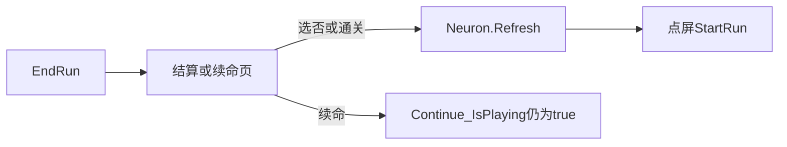

# 无尽模式并入主工程（基于参考目录逻辑移植）

## 文档约定：YAML frontmatter 与 `overview`

- **YAML 头位置**：文件最上方、**第一行 `---` 与第二行 `---` 之间**是 Cursor 计划的 frontmatter（YAML），其中的 `name`、`overview`、`todos` 等供工具/人类索引用，**不是**玩法规格正文。
- **`overview` 是什么**：同一 YAML 块里的 `overview: "……"` 是**单行字符串摘要**，给 Cursor / 人快速扫一眼「这份计划讲什么」。
- **为什么说不宜把 `overview` 写得很长**：若把已在正文 §1–§9 写过的**契约**（如先 `Neuron.Refresh` 再派发模式事件）、**验证命令**（如 `Unity -batchmode …`）、**`[PASS]` / `[FAIL]` 规则**等再整段塞进 `overview`，会导致：  
  - 一行极长，**diff、搜索、并排对比**都不方便；  
  - 以后只改正文、忘记同步 `overview` 时，**两处容易不一致**。  
- **推荐做法**：`overview` 只保留目标级概括（见当前 YAML 顶栏）；**详细条文、风险表、验收清单一律写在正文各节**；改需求时**优先改正文**，再视需要改短或微调 `overview`。

### 与仓库 Plan 协议（plan-reviewer）的映射

以下不重复粘贴规则全文；执行本计划范围内的**增量改动**或审 PR 时，用本节把「起草—找茬—三栏交付」落到本文档锚点。

| 协议要点 | 在本计划中的落点 |
|----------|------------------|
| **极简任务豁免**（纯文案/单色等） | 可跳过全量 Play 清单；若仍触及 `Assembly-CSharp`，建议至少跑 §5.0 CLI，避免漏编译错误。 |
| **前置消除信息差**（读基类、grep 爆炸半径） | 动 `GameMode` / `Neuron.Refresh` / `Pine` / `PineGenerator` / 订阅模式事件前：必读 [`PriorityChain.cs`](Assets/Scripts/Assembly-CSharp/PriorityChain.cs)、[`Neuron.cs`](Assets/Scripts/Assembly-CSharp/Neuron.cs) 的 `Refresh` 与事件分发；`grep` `GetDistance`、`Changed`、`TrySetMode`、`OnRefresh`。 |
| **四维度找茬**（生命周期 / 时序 / 边界 / 范围） | **生命周期**：§1.1、§2.3b、§3、`OnDisable` 退订、§8 `IsPlaying` 与 `Refresh`；**时序**：§1.1 先 `Refresh` 再事件、§2.0 `GetPriority`、§6 `Changed` 重入；**边界**：§2.0 单例未就绪、`Juice`/翻译键缺失时的降级（§3、§6 本地化行）；**范围**：§6 双 `Refresh`、不手写 `manifest`、优先单点调优先级而非堆抽象。 |
| **最终输出三栏** | 全文权威索引为 §9；§0 表为实施期文件清单，与 §9「Agent」条目不冲突时以 §9 为合并/审阅摘要。 |
| **对话与 md 分工** | Draft / Iteration 长文写在 PR 描述或对话里即可；**本 md 只保留稳定条文与锚点表**，避免计划文件被瞬时推演刷屏。 |
| **While-Loop 上限**（与 plan-reviewer 退出条件一致） | 同一问题连续「找茬—补丁」**最多 3 轮**；仍无法消除架构级隐患 → 写入 §8 / §9「残余风险」并**移交人类**，禁止为凑闭环无限扩 scope。 |
| **极简豁免的交付形态** | 命中豁免时：对话或 PR 可用单行 **`📝 最终输出 (Final Plan)`** 起头，下列 §9 三栏的**极简勾选**（可仅链到 §0 表 + 变更文件列表），不必展开多轮 Iteration 全文。 |

**四维度抽检可复制模板**（无尽相关 PR / 对话自检时粘贴勾选）：

- [ ] **1. 状态机与生命周期**：`OnDisable` 退订、`IsPlaying`/`Refresh`/续命/广告路径无泄漏、无销毁后协程写 UI（对照 §1.1、§2.3b、§3、§8）。
- [ ] **2. 时序与并发**：`TrySetMode` 先 `Neuron.Refresh` 再派发事件；`OnRefresh` 与 `GetPriority` 无倒置；`GameMode.Changed` 内无同步重入切模式/整局 `Refresh`（§1.1、§2.0、§6）。
- [ ] **3. 边界与异常**：单例未就绪、`GetDistance` 防御、Inspector 缺引用降级、`Juice`/翻译键缺失不崩（§2.0、§3、§6）。
- [ ] **4. 过度设计审查**：无不必要抽象层；无双 `Refresh`；不手写 `manifest`/`packages-lock`；优先调优先级等小补丁（§6、§0）。

**与编码阶段 `agent-execution-loop.mdc` 的衔接**：实装时若启用该规则：发现**本计划条文与仓库代码致命冲突**须停手、**禁止私自用工具改写本计划 md**，向人类申请图纸变更后再动代码；每次逻辑改动后须有**终端可核查**的验证输出（与 §5.0 一致）。

## 0. 人机分工（序列化与编辑器边界）

- **Agent 可改**：`Assets/Scripts/Assembly-CSharp/**/*.cs`（及同计划明确列出的其他 `.cs` 路径）；逻辑、状态分支、协程、对外 `SerializeField` API。
- **Agent 禁止直接改**：`.unity`、`.prefab`、`.meta`、`Packages/manifest.json`、`packages-lock.json`、ProjectSettings 下自动生成项；避免用文本工具批量改 YAML 序列化资产。
- **User 在 Unity 编辑器内完成**：Canvas 节点树、`HUD_Level`/`HUD_Endless` 父物体、组件挂载、Inspector 引用拖拽、动画关键帧、**通过 Package Manager 添加** DOTween 等包（若选用）。
- **TODO 交接格式**（醒目、可 `grep`）：  
  `// TODO: [User Action] 请在编辑器 Inspector/属性面板 中完成此处引用的拖拽赋值或事件绑定`  
  若需补充具体对象名，接在同一行括号内；禁止仅留无说明的裸 `[SerializeField]`。

### [Agent 执行项]（纯代码文件清单，随实现勾选）

| 动作 | 文件（路径均相对仓库根） |
|------|-------------------------|
| 新增 | `Assets/Scripts/Assembly-CSharp/GameMode.cs`（或等价单文件入口） |
| 新增 | `Assets/Scripts/Assembly-CSharp/UIHudTransition.cs`（或等价 HUD 过渡组件） |
| 修改 | `Assets/Scripts/Assembly-CSharp/Neuron.cs` |
| 修改 | `Assets/Scripts/Assembly-CSharp/Skier.cs` |
| 修改 | `Assets/Scripts/Assembly-CSharp/PineGenerator.cs` |
| 修改 | `Assets/Scripts/Assembly-CSharp/Pine.cs` |
| 修改 | `Assets/Scripts/Assembly-CSharp/FinishLine.cs` |
| 修改 | `Assets/Scripts/Assembly-CSharp/GameCamera.cs` |
| 修改 | `Assets/Scripts/Assembly-CSharp/Level.cs` |
| 修改 | `Assets/Scripts/Assembly-CSharp/WoodenSign.cs` |
| 修改 | `Assets/Scripts/Assembly-CSharp/Tutorial.cs` |
| 修改 | `Assets/Scripts/Assembly-CSharp/Score.cs`（无尽独立 best、结算后 UI 文案） |
| 视需要 | `Assets/Scripts/Assembly-CSharp/RollingStone.cs` 等（仅当计划内功能触及再列入，扩大前更新本表） |

### [User 待办项]（编辑器内操作清单）

1. 在主场景 `Canvas` 下创建 `HUD_Level`、`HUD_Endless` 空父节点，调整 Rect。  
2. 将现有关卡 HUD（`Level` 组件所在层级）挂到 `HUD_Level` 下；无尽专用 Text/图标挂到 `HUD_Endless`。  
3. 将 `UIHudTransition`（或等价脚本）挂到常驻 UI 根物体，把两组根 `RectTransform`、所需 `CanvasGroup` **拖入 Inspector**。  
4. 若选用 DOTween：**在 Editor 的 Package Manager 添加包**，勿手写 `manifest`（由编辑器写回）。再通知 Agent 编写 `using DG.Tweening` 相关逻辑。  
5. 若有「模式切换」按钮：在 Inspector 绑定 `GameMode` 或中介组件的 `UnityEvent`/public 方法。  
6. 本地验收布局、字体、多语言文案与首帧无闪屏。

## 背景与关键约束

- **不可**将 [`无尽模式的玩法/Assets/Scripts/Assembly-CSharp`](无尽模式的玩法/Assets/Scripts/Assembly-CSharp) 整体覆盖进 [`Assets/Scripts/Assembly-CSharp`](Assets/Scripts/Assembly-CSharp)：参考 [`Neuron.cs`](无尽模式的玩法/Assets/Scripts/Assembly-CSharp/Neuron.cs) 与主工程 [`Neuron.cs`](Assets/Scripts/Assembly-CSharp/Neuron.cs) 事件模型不兼容（`NewGame`/`GameOver`/`Whoosh()` vs `StartRun`/`EndRun`/`Whoosh(int)`）。
- 参考 [`PineGenerator.cs`](无尽模式的玩法/Assets/Scripts/Assembly-CSharp/PineGenerator.cs)：摄像机 Y 下界持续生成 + Perlin + `AnimationCurve`；主工程碰撞结束局用 [`Neuron.EndRun()`](Assets/Scripts/Assembly-CSharp/Neuron.cs)。
- [`Skier.cs`](Assets/Scripts/Assembly-CSharp/Skier.cs) 约 379–384 行终点判胜必须仅在关卡模式生效；无尽永不写 `success = true`。
- [`Parameters`](Assets/Scripts/Assembly-CSharp/Parameters.cs) 中 `Level.GetFloat` 驱动采样器：无尽分支用独立**难度标量**包装，避免「UI 隐藏关卡但数值仍跟关卡」。

## 1. 全局模式与持久化

- 新增 `GameMode`（`enum`：`Level` / `Endless`）+ 持久化（[`Data`](Assets/Scripts/Assembly-CSharp/Data.cs) 或 `PlayerPrefs`，key 不与 [`Level.cs`](Assets/Scripts/Assembly-CSharp/Level.cs) 存档冲突）+ 静态可订阅的**模式变更事件**（实现上多为 `event Action<Kind> Changed`，名称以代码为准）。
- 切换模式：仅当 `!Neuron.IsPlaying()`；必要时 `Neuron.Refresh()` 与 [`Finger`](Assets/Scripts/Assembly-CSharp/Finger.cs)、[`PineGenerator.OnRefresh`](Assets/Scripts/Assembly-CSharp/PineGenerator.cs) 对齐。
- 无尽最高分：独立存档 key，不与 [`Score`](Assets/Scripts/Assembly-CSharp/Score.cs) 的关卡 best 混用。

### 1.1 状态机与刷新契约（实现后须长期遵守）

- **`TrySetMode` 成功路径**：先 `Neuron.Refresh()`，再派发模式变更事件；避免 UI/木牌在回调中读到仍属上一模式的 `PineGenerator`/`FinishLine` 等。
- **`Pine.ResetState`**：每次整局 `Refresh` 须**与当前 GameMode 无关**清零关卡与无尽共用的静态连击字段，禁止「仅无尽分支才清 endless 经济」导致无尽→关卡泄漏。
- **`Score` 无尽局结束**：`SaveEndlessBest…` 后须刷新「历史最佳」展示，避免只写盘、界面仍显示旧值。
- **`Neuron.IsPlaying`**：`EndRun` 后若未再走 `Refresh`，仍为 true 时 `TrySetMode` 会拒绝切换——属既有生命周期；文档不改为新缺陷，但在 Play 清单中须覆盖「死亡/结算后何时 Refresh」与切模式的组合。
- **`Neuron.MeterPlusOne` / `Whoosh`**：仅在 `StartRun` 已建立 `currentRun` 之后调用；若未来在 `Refresh` 与首帧 `StartRun` 之间插入计分路径，须防空引用（当前主流程一般不触发）。

## 2. 玩法层改动（按文件）

### 2.0 `Neuron.Refresh` 顺序与 [`PriorityChain`](Assets/Scripts/Assembly-CSharp/PriorityChain.cs)

- `GetPriority()` **数值更小**的 `Neuron` 在 `Refresh` 遍历中**更早**执行。
- 若 `OnRefresh` 中调用 `PineGenerator.GetDistance()`、`FinishLine.GetDistance()` 等，必须保证被依赖方**已在本轮 Refresh 内执行过**对应 `OnRefresh`（通过调高调用方 `GetPriority` 或调低被依赖方数值实现「被依赖者更早」）。
- 典型坑：`WoodenSign` 默认优先级 `0` 早于 `PineGenerator`（如 `2`）→ 无尽木牌首帧距离错；规避：`WoodenSign.GetPriority` 晚于 `PineGenerator`。
- `PineGenerator.GetDistance`（无尽）：单例未就绪时须有防御返回值（如 `0f`），禁止静默退回与无尽语义不一致的 `spawnY`。

### 2.1 [`Skier.cs`](Assets/Scripts/Assembly-CSharp/Skier.cs)

- 终点判胜包在 `GameMode == Level`；无尽不置 `success`。侧界/滚石仍 `Neuron.EndRun()`。

### 2.2 [`PineGenerator.cs`](Assets/Scripts/Assembly-CSharp/PineGenerator.cs)

- 关卡：保留 `spawnY` 与 `FinishLine.GetDistance()` 上限。
- 无尽：移植参考的相机下界循环；`Player`→`Skier`，`Singleton<GameCamera>.i`→[`GameCamera`](Assets/Scripts/Assembly-CSharp/GameCamera.cs) 静态 API；无尽用参考 `AnimationCurve`（与关卡 `FastNoiseUnity` 二选一于分支内）。
- `RollingStone`：**A** 无尽循环内继续按概率生成；**B** 无尽关闭生成并在代码路径清残留（实现时二选一写死并注释原因）。
- **关卡坐标恢复**：`Awake` 缓存初始世界坐标；`OnRefresh` 在关卡模式将 `transform` 拉回该位置（无尽会持续下移 `transform`，切回关卡时必须恢复，否则与 `spawnY`/生成游标不一致）。

### 2.3 [`Pine.cs`](Assets/Scripts/Assembly-CSharp/Pine.cs)

- 无尽分支移植参考连击/`ContinueWhooshCombo` 语义；汇总为一次 `Neuron.Whoosh(int)`。
- **续命首株**：续命后首棵「擦边」须避免重复 `Whoosh` 计分（实现上常用 `skipScoreThisPass` 一类标志）；**振动**应与「是否实际加分」一致，避免无分仍震。

### 2.3b 续命（`Neuron.Continue`）全链路

- [`PineGenerator.OnContinue`](Assets/Scripts/Assembly-CSharp/PineGenerator.cs)：无尽须调用 `Pine.ContinueWhooshCombo()` 再 `enabled = true`；关卡勿误开无尽专有分支。
- [`Level.OnContinue`](Assets/Scripts/Assembly-CSharp/Level.cs)：无尽早退、关卡恢复 `enabled`；避免无尽局误开进度条 `Update`。
- 与 §1.1 一致：续命不单独 `TrySetMode`；若 UI 在 Continue 流程里异步切模式，仍须等 `!IsPlaying` 再切。

### 2.4 [`Neuron.cs`](Assets/Scripts/Assembly-CSharp/Neuron.cs)

- `MeterPlusOne`：无尽下 `+= 1` 或用难度标量替代 `Level.Get()`（与 §2.6 一致）。

### 2.5 [`FinishLine.cs`](Assets/Scripts/Assembly-CSharp/FinishLine.cs) / [`GameCamera.cs`](Assets/Scripts/Assembly-CSharp/GameCamera.cs)

- 无尽下 `GetDistance()` 语义集中定义；排除误触 `dontFollow` + `FinishLine` 组合路径。`Juice.LevelStarts` 无尽传固定标签字符串。

### 2.6 难度

- `EndlessDifficulty = f(距离或时间)`，供无尽生成/滚石包装，不修改 `Parameters` 静态 `Sampler` 定义本身。
- **验收**：`grep` 或人工确认无尽热路径（`PineGenerator` 无尽分支、`RollingStone` 无尽概率等）**未误用** `Level.GetFloat()` 驱动本应「与关卡号解耦」的采样；若暂未抽独立标量，须在注释中写明「距离/曲线已替代关卡倍率」以便 Code Review。

### 2.7 [`Level.cs`](Assets/Scripts/Assembly-CSharp/Level.cs) / [`WoodenSign.cs`](Assets/Scripts/Assembly-CSharp/WoodenSign.cs) / [`Tutorial.cs`](Assets/Scripts/Assembly-CSharp/Tutorial.cs)

- 无尽：`Level` 禁用 `Update` 进度或整组 `CanvasGroup`；木牌与教程条件分支。
- **木牌**：无尽文案依赖 `PineGenerator.GetDistance()` 时，`WoodenSign` 的 `GetPriority` 必须**晚于** `PineGenerator`（见 §2.0）。

## 3. HUD 过渡（仅脚本侧规格）

- `UIHudTransition`：`AnimationCurve` + `RectTransform` 位移 + `CanvasGroup.alpha`；先退场 `HUD_Level` 再进场 `HUD_Endless`；动画期 `blocksRaycasts` 锁输入；缺失引用时降级不抛异常并 `Debug.LogWarning`。
- **初始屏内/外状态**：由脚本按 `GameMode` 在 `Awake` 设锚点偏移；**像素级布局**属 §0 User 项。
- **生命周期**：`OnDisable`/`OnDestroy` 须 `StopCoroutine` 并清理 `running` 引用，避免切场景或禁用物体后协程仍改 `RectTransform`；`OnGameModeChanged` 重入时若已存在 `running`，应先停再起（避免双协程叠化）。

## 4. 注释与 TODO（交付标准）

- 所有本计划**新增或实质性改写**的 C#：中文注释说明意图、前置条件、与参考目录差异；状态机跳转与异步流（协程）逐段说明。
- 凡依赖 §0 User 项才能闭环的序列化入口：`// TODO: [User Action] ...` 紧跟字段或 `Awake` 校验块旁。

## 5. 验证（每里程碑门禁）

0. **CLI 脚本编译（无独立 sln 时推荐）**：以本机 Unity Hub 安装路径调用 `Unity.exe -batchmode -nographics -quit -projectPath <仓库根>`，`-logFile` 指向仓库内可写路径；要求进程退出码 `0`，且对日志检索无 `error CS`、`Compilation failed`、`Scripts have compiler`。与 Editor Console 二选一或双跑均可；CLI 仅证明导入/编译，不替代 Play Mode。  
1. **Unity 脚本编译**：Console 无 CS 错误；与本轮改动相关的 Runtime 异常清零。  
2. **Play Mode 清单**：关卡（撞树/出界/续命/放弃/`Refresh`/通关 `success`）；无尽 **≥120s** 与队列/帧率粗测；`!IsPlaying` 下切模式（**对照 §8.1 R1、R4**：刚死不可切模式、同模式按钮不重开）；存档重启；**无尽→关卡**首局木牌距离与首株连击分；**关卡→无尽**首帧 HUD/距离无错；**续命**：无尽续命后首株分数/振动与连击是否符合 §2.3；**广告/插屏**：若走 `GameCamera` 等路径在关闭后以 `Neuron.Refresh` 回调，确认当前 `GameMode` 与 HUD/生成器一致、无「先事件后 Refresh」类倒序（与 §1.1 对照）；**暂停/后台**：若项目存在 `Time.timeScale=0` 的暂停菜单或 `Application.runInBackground` 相关逻辑，手测连击窗口（`Time.time` 依赖处）与无尽计分是否出现「暂停期间误断连」或「恢复后连跳」。  
3. **抽检**：§4 注释与 `TODO: [User Action]` 是否覆盖 Inspector 依赖点。  
4. **规划四维度抽检（无尽相关改动时）**：使用「文档约定」小节中的 **四维度抽检可复制模板**逐项勾选；并结合 **与仓库 Plan 协议映射**表对照 §1.1–§6；有任一项未满足则不得对外宣告 `[PASS]`。  
5. **收尾输出**（对用户单行）：`[PASS] 逻辑修改完毕，终端验证无误。` 或 `[FAIL]` + 首条证据；同一根因连续 **3** 次未过 → `[FAIL] 连续 3 次验证失败，等待人类介入。`  
6. **范围**：`[PASS]` 不覆盖 User 侧美术验收；仅覆盖 §5.0–5.5 中可由编译/Play/抽检/四维度表客观勾选的项（本句为 §5 内语义边界说明）。

## 6. 风险与规避

| 风险 | 规避 |
|------|------|
| 误改 YAML 序列化 | 严守 §0；仅改 `.cs` |
| `FinishLine.GetDistance` 误用 | 无尽语义单点实现 + grep；详 §8.1 R3 |
| Pine 池残留 | 切模式后 `Neuron.Refresh()` / `OnRefresh` 清队列 |
| 分数语义混 | 无尽独立 best key |
| UI 闪屏 | 脚本设初始偏移 + User 调 Rect；HUD 引用见 §8.1 R5 |
| `OnRefresh` 顺序倒置 | §2.0：`GetPriority` 显式排序 + `GetDistance` 单例空防御 |
| `TrySetMode` 与 HUD 双次 `Refresh` | 整局 `Refresh` 单点触发；`UIHudTransition` 不再调用 `Neuron.Refresh`；同模式不重开见 §8.1 R4 |
| `Run.GetDefault()` 在无尽仍填 `Level.Get()` 作 `run.level` | 统计若已用 `GameMode`/Juice 标签分流则无妨；未来若有逻辑误读 `run.level` 为无尽难度，再评估改为 `0` 或独立字段；详 §8.1 R2 |
| `GameMode.Changed` 内重入 | 回调内禁止同步 `TrySetMode` / 整局 `Neuron.Refresh`；新增订阅须在 `OnDisable` 退订 |
| 静态 `Changed` 多实例或多重订阅 | 同场景仅挂一份驱动或统一入口；`OnDisable`/`OnDestroy` 必须 `-=`，避免重复动画或泄漏 |
| `PineGenerator.EnsureEndlessCurve` 写回 `[SerializeField]` | 仅在运行时空曲线时赋值；避免误覆盖 Inspector 已调好的曲线（可文档约定「空则用默认」） |
| 结算 UI 与 `Finger` 竞态 | 死亡至 `Refresh` 窗口内误触开新局与切模式、续命交叉；Play 清单用手测覆盖；详 §8.1 R1 |
| `Time.timeScale` / 暂停与 `Time.time` | `Pine` 等连击窗口若用 `Time.time`，暂停时时间不走、恢复后可能与玩家体感不一致；若产品要求暂停冻结连击时钟，须在注释与 QA 清单中写明预期，否则评估 `unscaledTime` 或暂停时禁止 Whoosh 判定 |
| `ApplicationPause` / 切后台 | 与 `Neuron` 系统事件及广告回调交织时，确认无尽局恢复后 `IsPlaying`、输入与生成器 `enabled` 仍一致；无自动用例则依赖 §5.2 手测 |
| 多场景 / Additive 加载 | `GameMode` 为进程级静态时，卸载场景须 `OnDisable` 退订 `Changed`；避免旧场景 UI 订阅存活到新场景导致错误动画或二次 `TrySetMode` |
| 本地化与无尽专有文案 | 新增 `Juice.translator` 键时须在翻译表补全；无尽 HUD 若复用关卡字符串，避免显示关卡号语义（与 `WoodenSign` 无尽分支一致） |

## 7. 实施顺序（每步后执行 §5 再进下一步）

1. `GameMode` + 持久化 + `IsPlaying` 守卫。  
2. `Skier` 禁用无尽判胜 + `Level` 等无尽静默。  
3. `PineGenerator` 无尽主循环 + RollingStone 策略。  
4. `Pine` + `Neuron.MeterPlusOne` + `OnContinue` 连击。  
5. `UIHudTransition` + `GameCamera`/`FinishLine`/木牌/教程扫尾 + 全量 §5。  
6. 对照 §2.0 审计所有新增/改动的 `OnRefresh` 与 `GetPriority`，grep `GetDistance`、`FinishLine`、`PineGenerator` 跨类读取点。  
7. 对照 §2.3b 走一遍无尽/关卡续命各一次，确认 `Level`/`PineGenerator`/`Pine` 三分支无遗漏。

---

## 8. 残余风险提示（架构层无法在本计划内根除）

审查维度已覆盖：状态机与生命周期、时序与重入、边界与空依赖、范围（避免双次 `Refresh` 等）、续命全链路（§2.3b）、HUD 协程与禁用销毁（§3）、暂停与 `timeScale`（§6）、多场景订阅（§6）；与 §1.1、§2.0、§5–§6 增补一致。**维护时优先阅读 §8.1（五条必读）**；下列 bullet 为架构级补充（GC、Domain Reload、Hub 版本等），非单靠本特性分支可证伪为「零风险」。

### 8.1 五条残余风险标注说明（维护必读）

与 C# 内 `【残余风险·…】` / `grep "残余风险"`（`Assets/Scripts/Assembly-CSharp`）双向对照；改行为时须同步更新本节与代码注释。

#### R1 — `Neuron.IsPlaying` 与 `EndRun`

- **含义**：撞树/出界等会调用 `EndRun()`，但**不会**清除 `IsPlaying`；只有 `Neuron.Refresh()` 会将 `isPlaying = false` 并重置各 `OnRefresh` 子系统。
- **影响**：在「已死、尚未 `Refresh`」期间，`GameMode.TrySetMode` 因 `Neuron.IsPlaying()` 为 true 而**拒绝切模式**（日志：对局中禁止切换模式）。属主工程原有生命周期，**非无尽独有**。
- **应对与验收**：菜单切模式须先走完 **死亡 → 续命/结算 → 广告或过渡 → `Refresh`**，不可刚死立刻切。本工程无独立「重新开始」按钮；重开路径为 **`Refresh` 后点屏 `StartRun`**（`Finger.OnTap`）。续命（`Neuron.Continue`）不 `Refresh`，`IsPlaying` 仍为 true，仍不可切模式。Play 清单须覆盖结算/广告/放弃后的 `Refresh` 路径（见 §5.2）。
- **代码锚点**：[`Neuron.cs`](Assets/Scripts/Assembly-CSharp/Neuron.cs)（`EndRun` / `Refresh` / `IsPlaying` 文档注释）、[`GameMode.cs`](Assets/Scripts/Assembly-CSharp/GameMode.cs)（`【残余风险·IsPlaying】`）。

#### R2 — `Run.GetDefault()` 与 `Level.Get()`

- **含义**：新开一局时 `Run.level` 仍来自 `Level.Get()`（当前关卡存档号），即使用户处于无尽模式。
- **影响**：若某段逻辑**误把 `run.level` 当作无尽难度或无尽 UI 展示**，会不正确。
- **应对**：无尽每米计分用 `Neuron.MeterPlusOne`（无尽 `+1`）；统计/埋点用 `GameMode` 与 `Juice.LevelStarts("endless")`；**勿**用 `run.level` 驱动无尽难度。若未来新功能依赖关卡号，须先 `GameMode.IsEndless` 分支。
- **代码锚点**：[`Run.cs`](Assets/Scripts/Assembly-CSharp/Run.cs)（`level` 字段与 `GetDefault` 注释）、[`GameCamera.cs`](Assets/Scripts/Assembly-CSharp/GameCamera.cs) `OnStartRun` 标签分流。

#### R3 — `GameCamera.dontFollow` 与 `FinishLine` 哨兵

- **含义**：`dontFollow == true` 时镜头 Y 由 `FinishLine.GetDistance()` 计算。无尽模式下终点距离为**大哨兵值**（如 `100000`），用于把终点物体移出玩法区，**不是**真实滑行长度。
- **影响**：若在无尽路径**误将 `dontFollow` 置 true**，镜头会被拉到极远。
- **应对**：无尽 `Skier` **不写** `success = true`；`dontFollow` **仅在关卡通关 `success` 时**于 `GameCamera.OnEndRun` 开启——设计上已隔开。改相机逻辑时勿破坏该前提。
- **代码锚点**：[`FinishLine.cs`](Assets/Scripts/Assembly-CSharp/FinishLine.cs)、[`GameCamera.cs`](Assets/Scripts/Assembly-CSharp/GameCamera.cs)（`【残余风险·FinishLine 哨兵】` / `dontFollow`）。

#### R4 — `TrySetMode` 同模式

- **含义**：当前已是目标模式时（如已是无尽再点「无尽」），`TrySetMode` **直接 `return true`**，**不**调用 `Neuron.Refresh()`，**不**触发 `GameMode.Changed`。
- **影响**：树、连击、`PineGenerator` 位置等**不会**被强制重置；玩家若以为「再点一次同模式 = 重开整局」，**实际不会**。
- **应对**：重开须走 **§8.1 R1** 的 `Refresh` 链，或 **切换到另一种 `Kind`**（会 `Refresh`）；若产品需要「同模式重开」，须新增显式 API（如按钮调 `Neuron.Refresh()`），**当前未实现**。
- **代码锚点**：[`GameMode.cs`](Assets/Scripts/Assembly-CSharp/GameMode.cs)（`【残余风险·同模式】`）、[`UIHudTransition.cs`](Assets/Scripts/Assembly-CSharp/UIHudTransition.cs)（`UserRequest*Mode` / 类 `remarks`）。

#### R5 — §0 User（Inspector 配置）

- **含义**：`UIHudTransition` 等脚本逻辑在 C# 中，但 `hudLevelRoot`、`hudEndlessRoot`、`inputBlocker` 及模式按钮须在 **Unity Inspector** 拖拽绑定（Agent 不改 `.unity` / `.prefab`）。
- **影响**：未赋值时 `LogWarning`，**无**关卡/无尽 HUD 滑入滑出动画；**玩法逻辑仍可运行**（生成、计分、切 `GameMode` 存档仍有效）。
- **应对**：完成 §0「[User 待办项]」清单 1–6；验收布局、首帧无闪屏、模式按钮绑定。
- **代码锚点**：§0 User 清单；[`UIHudTransition.cs`](Assets/Scripts/Assembly-CSharp/UIHudTransition.cs) `TODO: [User Action]`。

**生命周期简图（R1 / R4 相关）**：

**检索约定**：代码内 `grep "残余风险"`（`Assets/Scripts/Assembly-CSharp`）；计划内检索 `§8.1` 或 `R1`–`R5`。

---

- **`Neuron.IsPlaying` 与 `Refresh` 解耦**：详见 **§8.1 R1**。
- **`GameMode.Changed` 与重入**：若在事件内再次切模式或整局 `Refresh`，可能与 `TrySetMode` 已定顺序冲突；规避见 §6 表末行与 §9「Agent 执行项」。
- **第三方/包版本**：Hub 多版本 Unity 下 `-projectPath` 首次打开可能触发升级流程，自动化门禁需固定 Editor 版本路径或 CI 镜像。
- **`Neuron.Refresh` 内 `GC.Collect()`**：整局刷新可能带来单帧卡顿；与无尽长跑性能问题正交，若 profiling 热点在此需架构级调整，非本计划单点补丁。
- **Domain Reload**：编辑器下「进入 Play Mode 是否重置域」影响静态字段与事件订阅行为；验收时须在项目所用设置下各测一轮，避免「仅冷启动有效」的假阴性。
- **时间与暂停语义**：连击与无尽经济若绑定 `Time.time`/`Time.deltaTime`，与 `timeScale`、插屏暂停、系统时钟跳变（极少）组合后的表现，本计划不上升为形式化证明，依赖 §5.2 与产品预期对齐。

---

## 9. 最终输出摘要（与 plan-reviewer「施工图纸」三栏对齐）

本节为全文索引，细节仍以 §0–§8 为准；后续改无尽相关逻辑时先对照本节再下钻。**与 plan-reviewer 对齐**：交付给协作者/评审时，至少给出本节三栏 + §5 清单中 **「收尾输出」** 条所列单行句式；四维度推演过程用「文档约定」内映射表定位条文，不必把多轮 Iteration 全文贴进本文件。

### [Agent 执行项]

- 仅改 `Assets/Scripts/Assembly-CSharp/**/*.cs`（及本计划 §0 表列路径）；禁止直接改 `.unity` / `.prefab` / `.meta` / `manifest` / `packages-lock` 等序列化资产。
- 遵守 §1.1：`TrySetMode` 先 `Neuron.Refresh` 再派发模式事件；`Pine.ResetState` 与模式无关整局清零；无尽结算写盘后刷新最佳分文案。
- 遵守 §2.0：凡 `OnRefresh` 跨组件读 `GetDistance`/生成器状态，核对 `GetPriority`；无尽 `GetDistance` 对单例未就绪有防御返回值。
- 遵守 §2.3b：`PineGenerator`/`Level` 与 `Pine.ContinueWhooshCombo` 在无尽续命路径上一致；改其中任一处须回归 §5.2 续命用例。
- 遵守 §3：`UIHudTransition` 不重复调用整局 `Refresh`；订阅 `GameMode.Changed` 的脚本在 `OnDisable` 退订（避免销毁/切场景泄漏与悬空回调）。
- 遵守 §4：新改 C# 中文注释 + `TODO: [User Action]` 覆盖 Inspector 依赖。
- 每轮合并前跑 §5.0（CLI）与 §5.1–5.2（Editor/Play）门禁；宣告 `[PASS]` **前**须完成 §5 清单中 **「规划四维度抽检」** 条（含「文档约定」内**可复制模板**全勾选）；收尾单行 `[PASS]` / `[FAIL]` 及同根因 3 次停手见 §5 **「收尾输出」** 条。同一技术问题上 plan-reviewer 式找茬**超过 3 轮仍不稳** → 停手并更新 §8/§9 残余风险，**不得**为凑闭环无限扩 scope。
- 若实装阶段遵守 `agent-execution-loop.mdc`：发现**本计划与代码致命冲突**时**禁止**私自用工具改写本计划 md；须由人类更新本文档后再改代码。

### [User 待办项]

- 与 §0「[User 待办项]」清单 1–6 一致：Canvas/HUD 层级、`UIHudTransition` 引用拖拽、可选 DOTween 由 Package Manager 添加、模式按钮绑定、本地布局与无闪屏验收。

### [残余风险提示]

- **五条必读**：见 **§8.1（R1–R5）**；其余架构级项见 §8 bullet 与 §6 表。
- 与 §8、§6 一致：**batchmode 与 Editor 行为差**、**Hub 多版本**、**Domain Reload / GC.Collect**、**Time.timeScale / 暂停语义**、**多场景订阅**；**`GameMode.Changed` 回调内禁止同步再次 `TrySetMode` 或整局 `Neuron.Refresh`**；禁止同场景重复挂载多份仅依赖 `Changed` 的 HUD 驱动而不退订/幂等防护。
