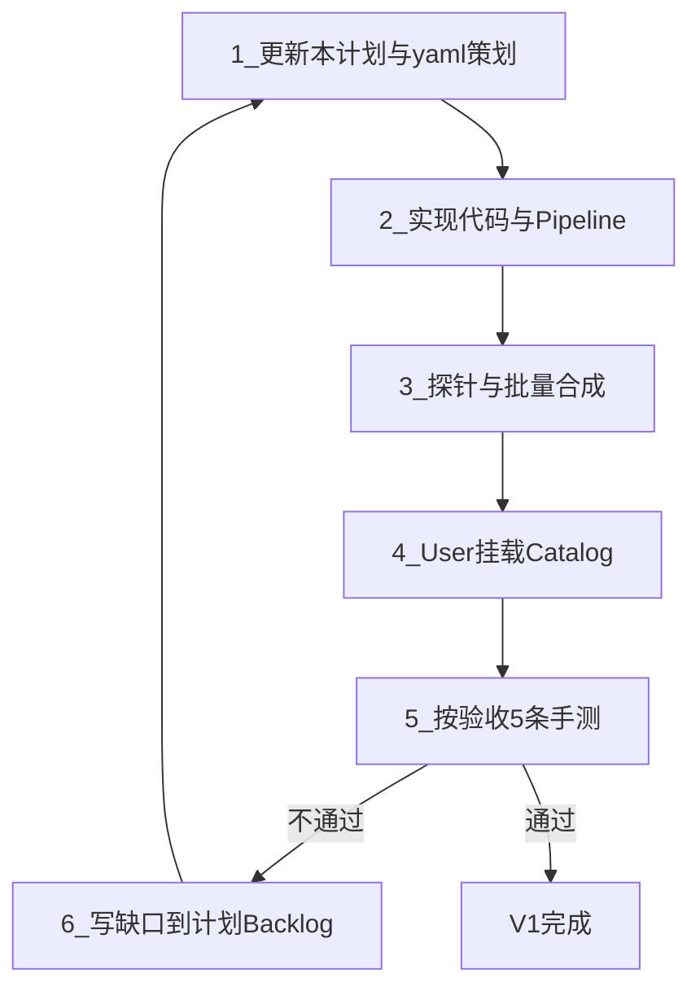

# 滑雪陪玩语音助手（本地包 V1）

## 已锁定

- **交付**：运行时全本地 `AudioClip`；火山 TTS 只用于制作期预生成。
- **产品**：事件旁白 + 轻陪伴；不做自由对话、不做局内在线 TTS。
- **挂接**：仅 [`Neuron.cs`](Assets/Scripts/Assembly-CSharp/Neuron.cs) / `MainLevelMode`。
- **开关**：与文字鼓励共用 [`MotivationalButton.motivationalOn`](Assets/Scripts/Assembly-CSharp/MotivationalButton.cs)；静音跟随 [`Device.IsSoundOn`](Assets/Scripts/Assembly-CSharp/Device.cs)。
- **鉴权**：**新版 API Key**（Header `X-Api-Key`）；**不用**旧版 AppId + AccessKey。
- **模型**：`seed-audio-1.0`（与新版控制台一致；探针不通再按文档调整）。
- **音色**：`zh_female_vv_uranus_bigtts`（Vivi 2.0）。
- **语言**：V1 中文短句；全包同一音色。
- **密钥存放**：User 稍后自行写入本计划「密钥占位」或本机环境变量；**禁止提交真实 Key 到 git**。

## 产品定位

| 层 | 含义 | V1 覆盖 |
|---|---|---|
| 事件旁白 | 特殊操作当下给情绪反馈 | Whoosh 分档、Fever、失败、通关 |
| 轻陪伴 | 非操作高潮时的陪伴感 | 开局问候、里程碑、冷场提醒、续命鼓励 |

## V1 触发表

| 槽位 | 来源 | 规则 |
|---|---|---|
| Greeting | `OnStartRun` | 每局 1 次；Catalog 分 `GreetingLevel` / `GreetingEndless` |
| WhooshGood～Perfect | `OnWhoosh` + combo | ≤1 不播；2/3/4～6/>6 四档；同档冷却 ≈1.2s |
| Fever | `SetInFever(true)` 边沿 | 每段 Fever 1 次 |
| Milestone | `OnMeterPlusOne` 聚合 | 无尽每 50m；关卡首次过半程 |
| IdleNudge | Companion 计时 | 开局 ≥8s 且尚无 Whoosh；每局最多 1 次 |
| Fail | `OnEndRun` 失败 | delay ≈0.2s |
| Clear | `OnEndRun` 通关 | 仅关卡 |
| Continue | `OnContinue` | 每次续命 1 次 |

**不做**：逐米播报、转向逐帧、自由对话、运行时在线合成、独立 Mixer。

## 运行时（2 个脚本）

1. **`VoiceCatalog`**：各槽位 → `AudioClip[]`
2. **`VoiceCompanion`**：Neuron 订阅 + 选句/冷却/打断 + 单 `AudioSource`

Fever：[`Skier.SetInFever(true)`](Assets/Scripts/Assembly-CSharp/Skier.cs) 边沿通知一次。

优先级：Fail/Clear(100) > Continue(80) > Fever(70) > Whoosh(40～55) > Greeting(30) > Milestone(20) > IdleNudge(10)。

Whoosh 档位与 Motivational 一致：2=Good，3=Awesome，4～6=Exquisite，>6=Perfect。

## 内容量

每槽 2～3 句，全包约 30～35 句。短促中文；失败不嘲讽。

## 都要生成哪些（产物清单）

### A. 代码 / 工程（Agent）

| 产物 | 路径 |
|---|---|
| 运行时 | `Assets/Scripts/Assembly-CSharp/VoiceCompanion.cs` |
| 目录 SO | `Assets/Scripts/Assembly-CSharp/VoiceCatalog.cs` |
| Fever 钩子 | 改 [`Skier.cs`](Assets/Scripts/Assembly-CSharp/Skier.cs) 一处边沿通知 |
| Pipeline | `Tools/VoicePipeline/`（见下） |

### B. 文案与音频（Pipeline 生成）

| 产物 | 说明 |
|---|---|
| `Tools/VoicePipeline/catalog/voice_lines.yaml` | 全部短句文案（真相源） |
| `Tools/VoicePipeline/out/*.wav` | 火山合成音频，约 30～35 个文件 |
| `Tools/VoicePipeline/manifests/generated.json` | line_id → hash → 文件，支撑增量重生成 |
| 导入副本 | `Assets/TestAudio/vc_*.wav`（按产物规范落盘；User 再拖进 Catalog） |

### C. 按槽位生成数量（V1）

| slot | 句数 |
|---|---|
| GreetingLevel / GreetingEndless | 2～3 / 2～3 |
| WhooshGood / Awesome / Exquisite / Perfect | 各 2～3 |
| Fever / Milestone / IdleNudge | 各 2～3 |
| Fail / Clear / Continue | 各 2～3 |
| **合计** | **约 30～35** |

### D. User 在编辑器生成（非 Agent 改场景）

- 场景节点 + `VoiceCompanion` 组件挂载  
- `VoiceCatalog` 资产创建并填 clip  
- 专用 `AudioSource`  

## 自动化工作流（怎么实现）

不做重型多脚本编排；**一个合成脚本 + yaml + 人工验收回流** 即可。

### 目录

```text
Tools/VoicePipeline/
  catalog/voice_lines.yaml
  scripts/synthesize.py      # --probe | 全量 | --only <id>
  manifests/generated.json
  out/                       # wav 输出
  README.md                  # 命令说明
```

### 命令（实现时写进 README）

```bash
cd Tools/VoicePipeline
# 1) 探针：确认 API Key + model + speaker
python scripts/synthesize.py --probe

# 2) 按 yaml 增量合成（只重出 hash 变化的句子）
python scripts/synthesize.py

# 3) 只重做某一句
python scripts/synthesize.py --only whoosh_good_01
```

`synthesize.py` 职责：读 yaml → 算 hash → 调火山（`X-Api-Key`）→ 写 `out/` + 更新 manifest。  
yaml 校验规则内嵌即可：每 slot 至少 2 句、text 非空、字数 ≤18；缺则报错退出。

### 策划 → 实现 → 验收 → 再改进计划（闭环）



| 轮次 | 谁 | 做什么 | 完成标准 |
|---|---|---|---|
| 1 策划 | Agent | 写满 `voice_lines.yaml`（覆盖上表各 slot） | 每槽 ≥2 句 |
| 2 实现 | Agent | Companion/Catalog/Fever + `synthesize.py` | 编译通过；探针成功 |
| 3 合成 | Agent（需 Key） | 批量出 wav，拷到 `Assets/TestAudio/` | manifest 覆盖全部 line_id |
| 4 挂载 | User | 拖 Catalog / AudioSource | 场景可播 |
| 5 验收 | User+Agent | 跑下方 5 条 | 全过或列出缺口 |
| 6 改进 | Agent | 改 yaml/冷却参数/补句，必要时改本计划触发表 | 再跑 3→5，直到验收过 |

**回流写法（写进本计划文末 Backlog，勿另起系统）：**

```text
- [P0] 连击叠句 → 冷却调到 1.4s
- [P1] Fail 太假 → 换 2 条文案重合成 --only
```

连续一轮验收无 P0 即停；不追求无限优化。

## 火山预生成（新版 API Key）

环境变量（推荐；不入库）：

```text
VOLC_TTS_API_KEY=（User 稍后填写）
VOLC_TTS_MODEL=seed-audio-1.0
VOLC_TTS_SPEAKER=zh_female_vv_uranus_bigtts
```

### 密钥占位（User 自行补全，勿提交 git）

```text
VOLC_TTS_API_KEY=
```

Agent：`Tools/VoicePipeline/` = `voice_lines.yaml` + `synthesize.py`（按[新版 API](https://docs.volcengine.com/docs/6561/2550782?lang=zh) 用 `X-Api-Key` 批量出 wav）+ 简单 hash 增量。  
先 `--probe` 合成一句，确认 Key + model + Vivi 通后再批量。

文档：[新版 API 接入](https://docs.volcengine.com/docs/6561/2550782?lang=zh) · [音色](https://docs.volcengine.com/docs/6561/1257544?lang=zh)

## 验收（5 条）

1. 鼓励开关关 → 无语音  
2. 连击升档有鼓励，不疯狂叠句  
3. Fever / 失败 / 通关有对应句  
4. 开局问候；久不擦树有一次冷场  
5. 无尽约 50m 里程碑；续命有一句  

## 实现顺序

1. Catalog + Companion：Whoosh / Fail / Clear  
2. Fever + Greeting + Continue  
3. Milestone + IdleNudge  
4. yaml + 合成脚本 + 中文包  
5. User 挂载手测  

## [Agent 执行项]

- `VoiceCompanion.cs`、`VoiceCatalog.cs`  
- `Skier` Fever 边沿钩子  
- `Tools/VoicePipeline`（**API Key 鉴权**）+ 初始 yaml  
- `TODO: [User Action]` 拖拽锚点  
- 不改场景/预制体/meta；**不把真实 API Key 写入仓库**  

## [User 待办项]

### A. 合成前

- 将 API Key 填入上方「密钥占位」或本机 `VOLC_TTS_API_KEY`（二选一即可）  
- Model / Speaker 已锁定，一般不用改  

### B. Agent 交付后

- 挂 `VoiceCompanion`，拖 Catalog + AudioSource  
- 从 `Assets/TestAudio/` 导入/拖拽 wav 填槽位  
- 按验收 5 条反馈  

## 后续（不进 V1）

- V1.5：低频结算句在线 TTS；Whoosh/Fever/Fail 仍本地  
- V2：多音色 / 简单个性化  

## 残余风险

- 新版 `seed-audio-1.0` 与 Vivi 请求字段若与文档示例不一致 → 以[2550782](https://docs.volcengine.com/docs/6561/2550782?lang=zh) 为准，探针调通即可。  
- 总静音无法单独留语音 → V1 接受。  

## Backlog（验收回流，初始为空）

（手测后在此追加 P0/P1 条目，改完勾掉。）

## 合成进度

- 2026-07-22：探针 + 全量 36 句已合成，落盘 `Assets/TestAudio/vc_*.wav`（Vivi + seed-tts-2.0）。
- 待 User：Unity 挂载 Catalog / 验收 5 条。

## 计划完备性结论

**可以开干**（合成需你补 API Key）。已补齐：产物清单、槽位句数、Pipeline 命令、策划→实现→验收→改计划闭环。不必再扩设计面。
